# 실습 2 – AWS에서 웹 애플리케이션 배포

## 보안 구성

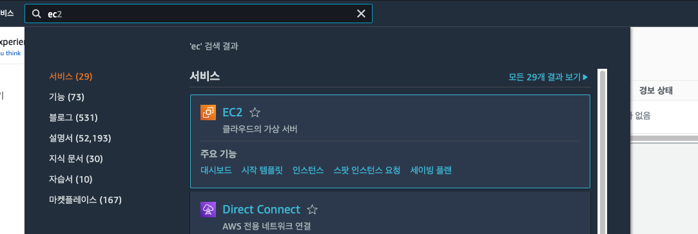
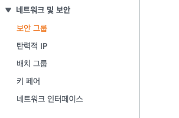
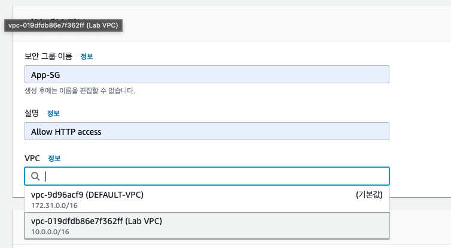
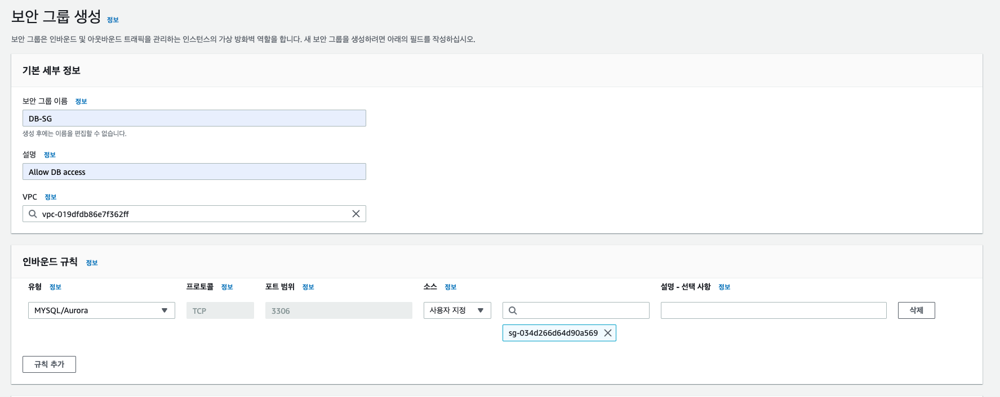
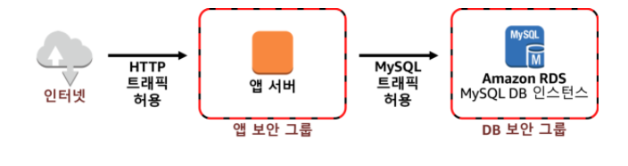

## Amazon RDS 데이터 베이스 생성

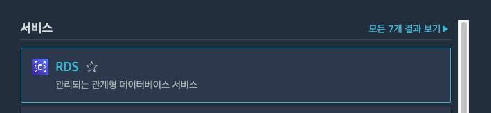
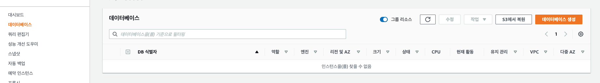
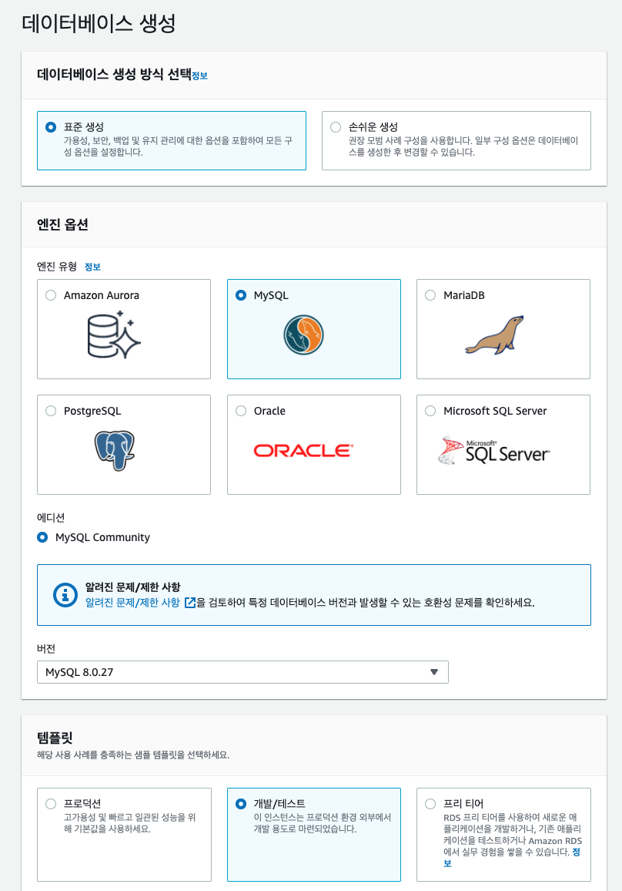
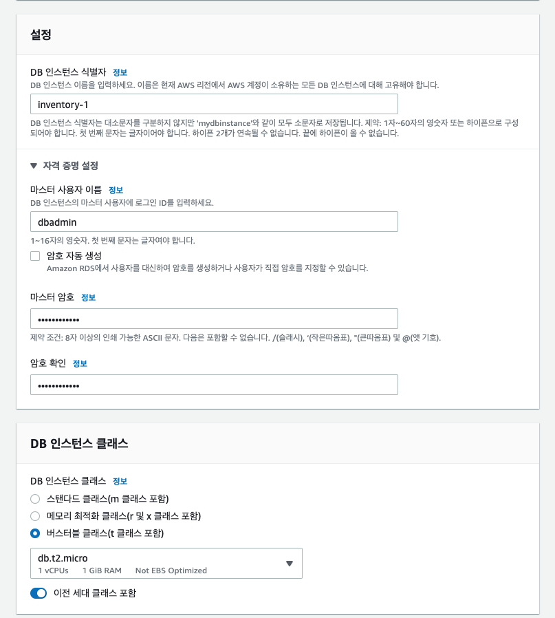
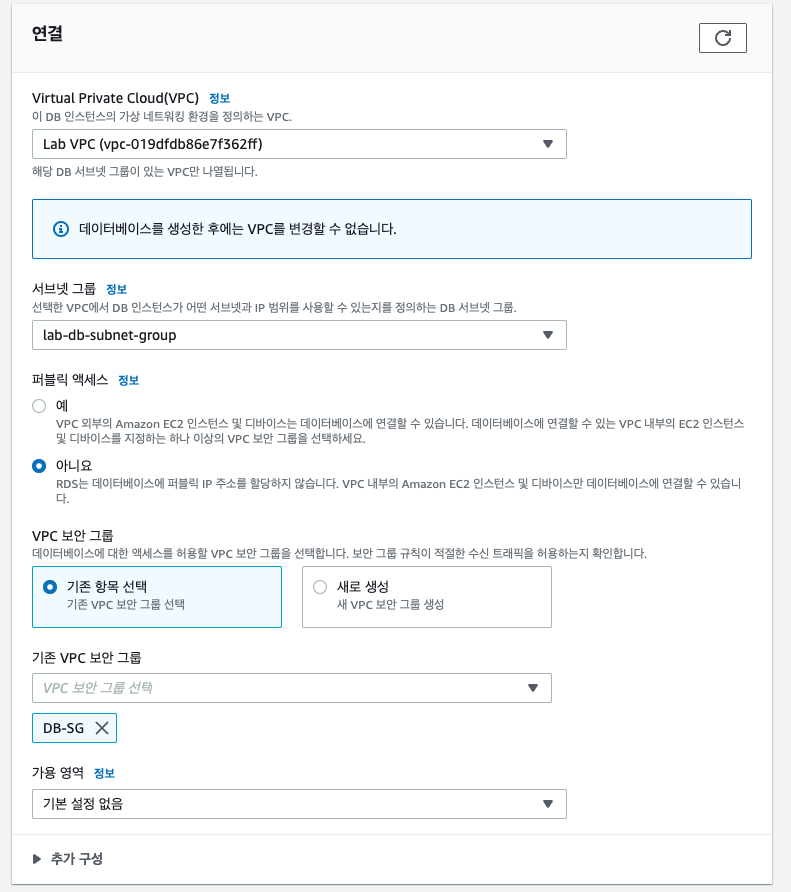
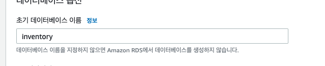
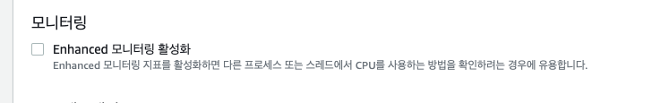
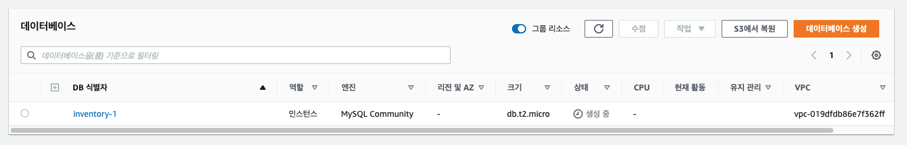

## Amazon EC2를 사용하여 애플리케이션 서버 시작

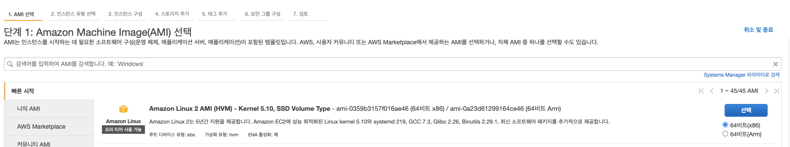
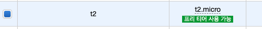

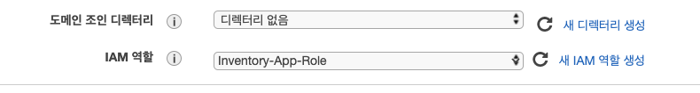
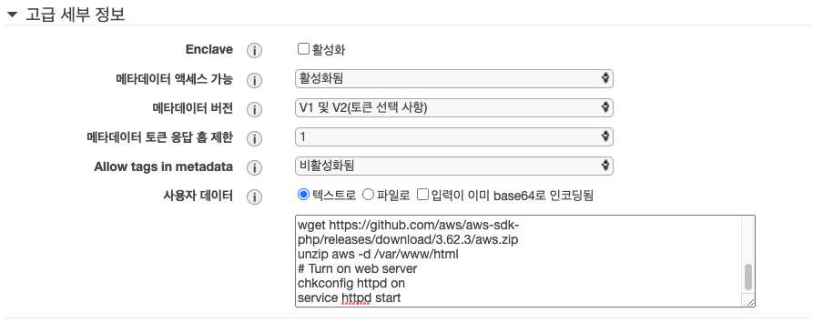

- Inventory-App-Role

```json
{
  "Version": "2012-10-17",
  "Statement": [
    {
      "Action": "ssm:*",
      "Resource": "arn:aws:ssm:*:*:parameter/inventory-app/*",
      "Effect": "Allow"
    }
  ]
}
```

- user data

```bash
#!/bin/bash
# Install Apache Web Server and PHP
yum install -y httpd mysql
amazon-linux-extras install -y php7.2
# Download Lab files
wget https://us-west-2-tcprod.s3.amazonaws.com/courses/ILT-TF-200-ARCHIT/v6.8.28/lab-2-webapp/scripts/inventory-app.zip
unzip inventory-app.zip -d /var/www/html/
# Download and install the AWS SDK for PHP
wget https://github.com/aws/aws-sdk-php/releases/download/3.62.3/aws.zip
unzip aws -d /var/www/html
# Turn on web server
chkconfig httpd on
service httpd start
```

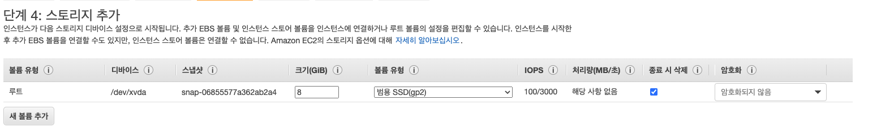
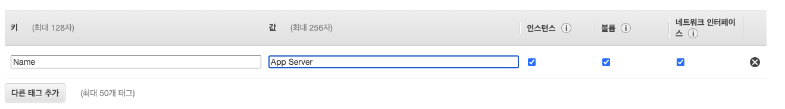
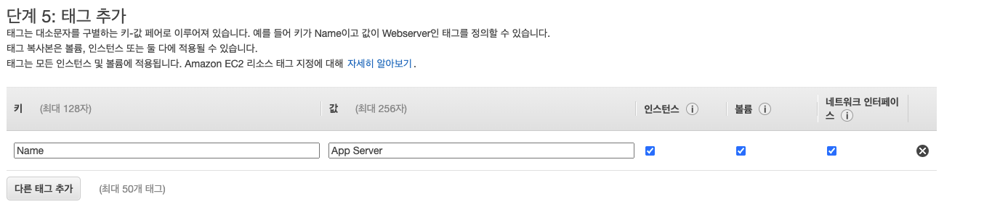
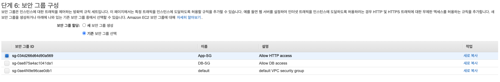
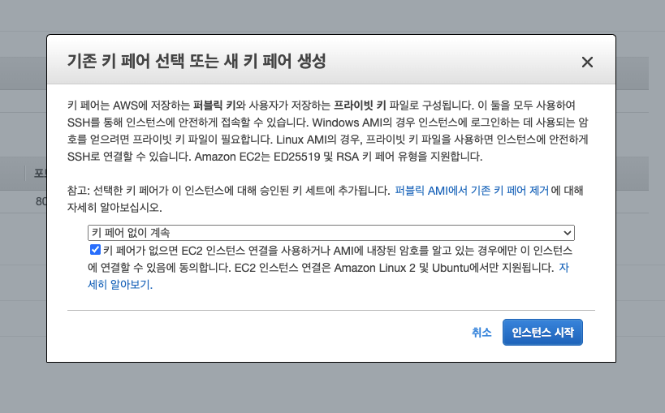
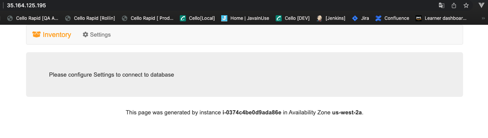

## 애플리케이션 테스트

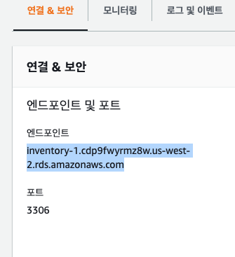
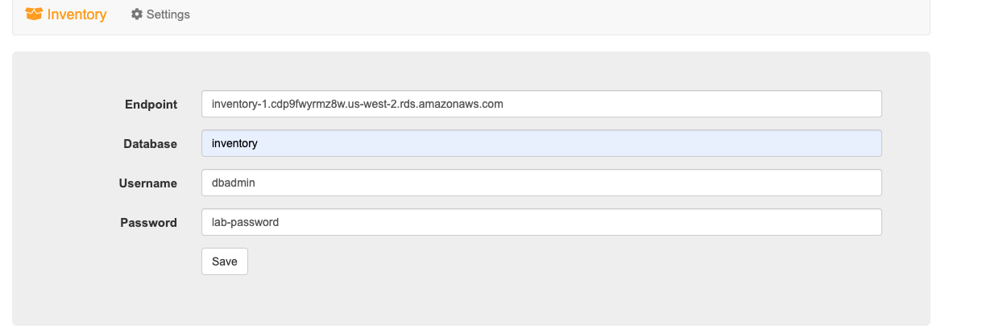

