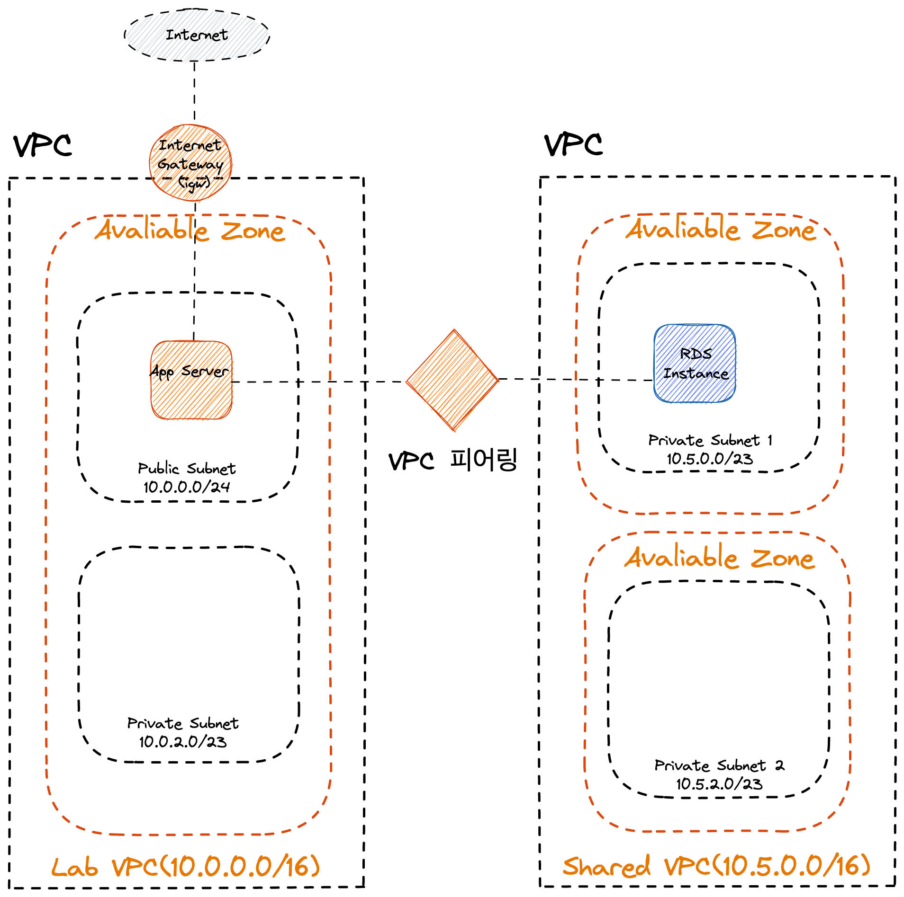
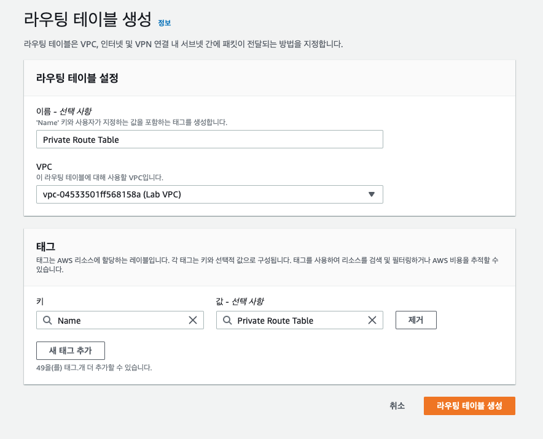

# 실습 3 – 가상 사설 클라우드 생성



## 목표 아키텍쳐 구성

- 인터넷 게이트웨이
- 퍼블릭 서브넷
- 프라이빗 서브넷
- VPC 테스트용 애플리케이션

## 작업 1: VPC 생성


### VPC 생성


- Name tag: Lab VPC
- IPv4 CIDR block: 10.0.0.0/16

#### DNS 호스트 활성화 시키기


## 작업 2: 서브넷 생성


### 퍼블릭 서브넷 생성


- Name tag: Public Subnet
- VPC: Lab VPC
- Availability Zone: ( 목록에서 보이는 첫번째 )
- IPv4 CIDR block: 10.0.0.0/24

### 퍼블릭 IPv4 주소 자동 할당 활성화


- 이름을 Public Subnet 으로 지정되었어도 아직은 퍼블릭 서브넷이 아님.
- 인터넷 게이트웨이가 있어야 퍼블릭 서브넷이 된다.

### 프라이빗 서브넷 생성


- Name tag: Private Subnet
- VPC: Lab VPC
- Availability Zone: ( 목록에서 보이는 첫번째 )
- IPv4 CIDR block: 10.0.2.0/23 ( 프라이빗 서브넷이 퍼블릭보다 많은 리소스를 유지하고 있기 때문에 2배 늘려놓는다 )

## 작업 3: 인터넷 게이트 웨이 생성


### 인터넷 게이트 웨이 생성


- Name tag: Lab IGW
- 이제 사용자의 Lab VPC에 인터넷 게이트 웨이를 연결할 수 있음.

### Lab VPC에 인터넷 게이트 웨이 연결


- 이제 Lab VPC 에 인터넷 게이트 웨이가 연결 됨.
- 하지만 VPC에 연결 되었어도 서브넷의 라우트 테이블도 인터넷 게이트 웨이를 사용하도록 해야 퍼블릭 서브넷을 만들 수 있음.

## 작업 4: 라우팅 테이블 구성

- 서브넷은 한 번에 하나의 라우팅 테이블에만 연결할 수 있지만, 여러 서브넷을 같은 라우팅 테이블에 연결할 수 있음.

### 라우팅 테이블 생성 ( 프라이빗 서브넷 )



- 이름 : Private Route Table
- VPC: Lab VPC
- Tag > Name : Private Route Table

- 경로는 1개 뿐 ( 10.0.0.0/16 ( Lab VPC 의 범위))
- 모든 트래픽이 내부로 라우팅 됨

### 라우팅 테이블 생성 ( 퍼블릭 서브넷 )


- 이름 : Public Route Table
- VPC: Lab VPC
- Tag > Name : Public Route Table

### 라우팅 테이블에 인터넷 게이트웨이 추가


### 퍼블릭 서브넷 만드는 과정

1. 인테넷 게이트 웨이 생성
2. 라우팅 테이블 생성
3. 0.0.0.0/0 트래픽을 인터넷 게이트웨이로 보내는 라우팅 테이블에 경로 추가
4. 라우팅 테이블을 서브넷과 연결

## 작업 5: 앱 서버용 보안 그룹 생성

- 보안 그룹은 인스턴스에대한 인/아웃바운드 트래픽을 제어하는 가상 방화벽 역할
- 서브넷 수준이 아닌 인스턴스 네트워크 인터페이스 수준에서 작동
- 그룹을 지정하지 않는다면 인스턴스가 자동으로 VPC의 기본 보안 그룹에 할당


### 보안 그룹 생성


- Security group name: App-SG
- Description: Allow HTTP traffic
- VPC: Lab VPC
- Inbound Rules: 유형 - HTTP / 소스 - Anywhere ( 0.0.0.0/0 )
- Outbound Rules: 유형 - 모든 트래픽 / 대상 - 0.0.0.0/0

## 작업 6: 퍼블릭 서브넷에서 앱 서버 시작

### EC2 인스턴스 시작


- AMI: Amazon Linux 2
- Instance Type: t2.micro
- Network: Lab VPC
- Subnet: Public Subnet
- IAM role: Inventory-App-Role
- User Data : ( below code )
- Storage : ( 기본설정 )
- Tag: Name: App Server
- Security Group: App-SG

```bash
#!/bin/bash
# Install Apache Web Server and PHP
yum install -y httpd mysql amazon-linux-extras install -y php7.2
# Download Lab files
wget https://us-west-2-tcprod.s3.amazonaws.com/courses/ILT-TF-100-ARCHIT/v6.6.1/lab-2-webapp/scripts/inventory-app.zip
unzip inventory-app.zip -d /var/www/html/
# Download and install the AWS SDK for PHP
wget https://github.com/aws/aws-sdk-php/releases/download/3.62.3/aws.zip
unzip aws -d /var/www/html
# Turn on web server chkconfig httpd on service httpd start
```

### 인스턴스 테스트


## 도전 과제: VPC 피어링 구성

### 피어링 연결 생성


- Peering connection name tag: Lab-Peer
- VPC ( Requester ): Lab VPC
- VPC ( Accepter ): Shared VPC

### 피어링 요청 수락

- 피어링 연결이 생성되면 대상 VPC의 accept를 받아야 함
- 대상 VPC를 다른 계정에서 소유하고 있거나 피어링 연결을 생성하는 사용자가 대상 VPC연결을 수락할 권한이 없을수 있기 때문.


### 라우팅 테이블 구성

#### 퍼블릭 라우팅 테이블 수정

- 이제 두 VPC의 라우팅 테이블을 업데이트하여 Lab VPC에서 피어링 연결로 트래픽을 전송


- Destination: 10.5.0.0/16 ( Shared VPC의 CIDR 범위 )
- Target: Peering Connection > Lab-Peer

#### Shared-VPC -> Lab VPC 트래픽의 역방향 흐름 구성


- Destination: 10.0.0.0/16 ( Lab VPC의 CIDR 범위 )
- Target: Perring Connection > Lab-Peer

### 피어링 연결 테스트


- Endpoint : RDS의 Endpoint
- Database: inventory
- Username: master
- Password: lab-password
