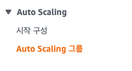
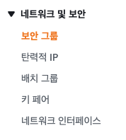
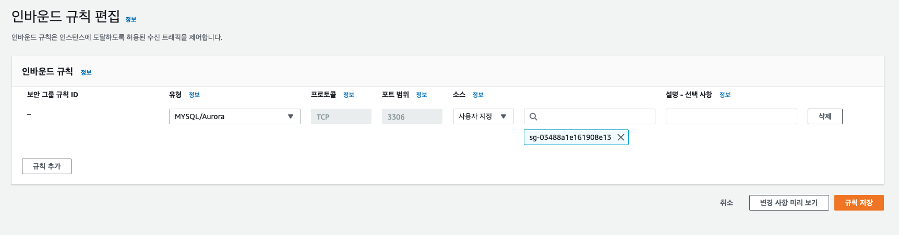

# 실습 4 – 고가용성 환경 생성


## 실습 목표

- 제공된 VPC 검사
- Applicaion Load Balancer 생성
- Auto Scaling Group 생성
- 애플리케이션 고가용성 테스트

## 작업 1: VPC 검사

### 제공된 환경


- 2개의 가용영역에 퍼블릭 및 프라이빗 서브넷이 있음
- 인터넷 게이트웨이는 퍼블릭 서브넷에 연결됨
- NAT 게이트웨이는 퍼블릭 서브넷중 하나에 있음
- Amazon RDS 인스턴스는 프라이빗 서브넷 중 하나에 있음

### VPC로 필터링 하기


### 서브넷 확인하기


- Public Subnet 1 ( us-west-2a )
- Private Subnet 1 ( us-west-2a )
- Public Subnet 2 ( us-west-2b )
- Private Subnet 2 ( us-west-2b )


- 10.0.0.0/24 == 10.0.0.0 ~ 10.0.0.255를 포함
- 가용영역은 usw2-az2

### 라우팅 테이블 확인하기


- 0.0.0.0/0 ( 모든 라우트 ) 가 인터넷 게이트웨이로 통하게 되있으므로 퍼블릭 서브넷임을 알 수 있다.

### 네트워크 ACL 확인하기


- 서브넷과 연결된 네트워크 ACL
- 모든 트래픽이 안밖으로 흐르는 것을 허용 ( 규칙 번호 100 )

### 인터넷 게이트 웨이 확인하기


- 인터넷 게이트 웨이는 VPC와 연결되어 있다 ( Attached | Lab VPC )

### 보안그룹 확인하기


- Inbound Rules : VPC내 어디서나 MySQL/Aurora 트래픽 ( 포트 3306 )을 허용
- 애플리케이션 서버의 트래픽만 허용하도록 바꿀 예정


- Outbound Rules : 모은 아웃바운드 허용

## 작업 2: Application Load Balancer 생성

### 대상그룹 생성

- 대상그룹 ( Target Group ) 은 로드 밸런서로 들어오는 트래픽을 보낼 위치를 정의


- EC2 > 로드밸런싱 > 대상그룹


- Target Type: Instances
- Name: Inventory-App
- VPC: Lab VPC
- Healthy threshold: 2
- Interval: 10


### 로드밸런서 생성


- Application Load Balancer 선택


- 맵핑 정보
- VPC: Lab VPC
- Mapping: 가용영역 us-west-2a, us-west-2b | 각각 Public Subnet 1, 2


- Name: Inventory-LB


- Security Group: LAbALBSecurityGroup


- 로드 밸런서로 들어오는 트래픽을 보낼위치를 정의
- Routing 정보 : HTTP:80 ( Inventory-App )


## 작업 3: Auto Scaling 그룹 생성

- 사용자가 정의한 정책, 일정 및 상태 확인에 따라 자동으로 EC2 인스턴스를 시작하거나 종료하도록 설계된 웹서비스
- 여러 가용영역에 인스턴스를 자동으로 분산하여 고가용성 애플리케이션을 생성할 수 있음.

### 시작 탬플릿 만들기


- Name: Lab-template-xxxx
- version: 1
- AMI: Amazion Linux


- Instance Type: t3.micro
- key pair: ( 시작 템플릿에 포함 X )
- Subnet : ( 시작 템플릿에 포함 X )
- Security Group: Inventory-App
- IAM Instance Profile: Inventory-App-Role


```bash
#!/bin/bash
# Install Apache Web Server and PHP
yum install -y httpd mysql
amazon-linux-extras install -y php7.2

# Download Lab files
wget https://us-west-2-tcprod.s3.amazonaws.com/courses/ILT-TF-100-ARCHIT/v6.6.1/lab-2-webapp/scripts/inventory-app.zip
unzip inventory-app.zip -d /var/www/html/
# Download and install the AWS SDK for PHP
wget https://github.com/aws/aws-sdk-php/releases/download/3.62.3/aws.zip
unzip aws -d /var/www/html
# Turn on web server
chkconfig httpd on
service httpd start
```


### Auto Scailing 그룹 생성

#### 1. 시작 템플릿 또는 구성 선택




- Name: Inventory-ASG
- initial template: Lab-template-xxxx
- version: 1

#### 2. 인스턴스 시작 옵션 선택


- VPC : Lab VPC
- AZ: Private Subnet 1, Private Subnet 2

#### 3. 고급 옵션 구성


- 기존 로드 밸런서에 연결 ( 아까 만든 로드밸런서에 연결 )
- Load Balancer: Inventory-App| HTTP

#### 4. 그룹 크기 및 조정 정책 구성


- 원하는 용량/ 최소 용량/ 최대 용량 = 2/2/2
- 조정 정책: 없음

#### 5. 태그 추가


- Name: Inventory-App ( 새 인스턴스에 태그 지정 )


## 과제 4: 보안 그룹 업데이트







