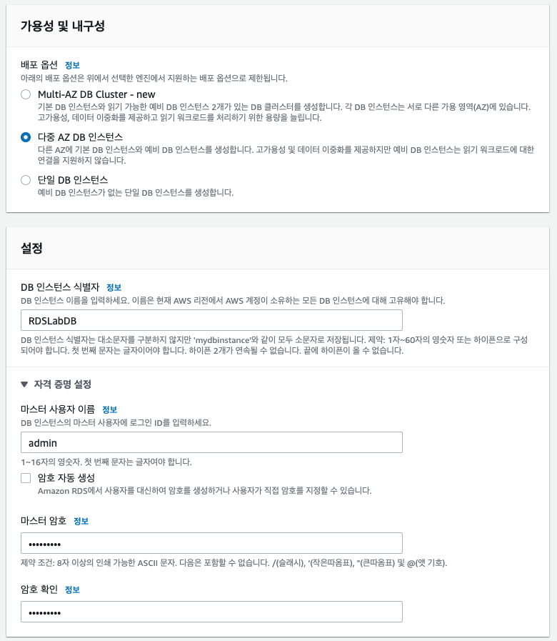
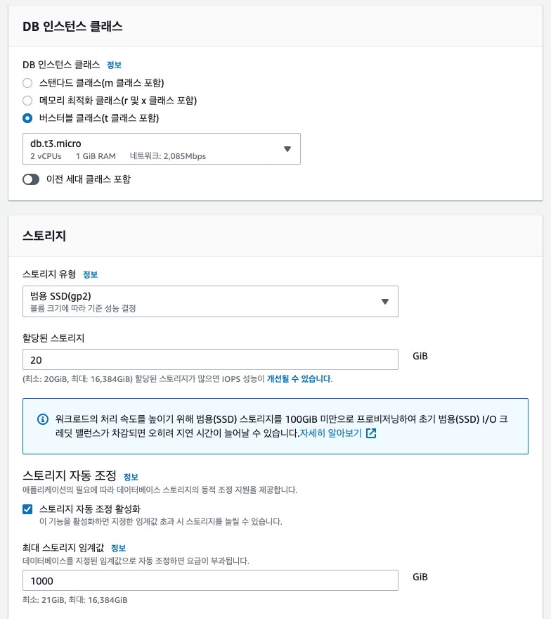
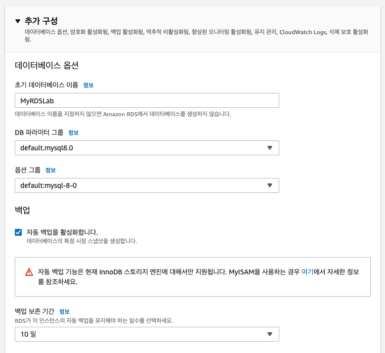
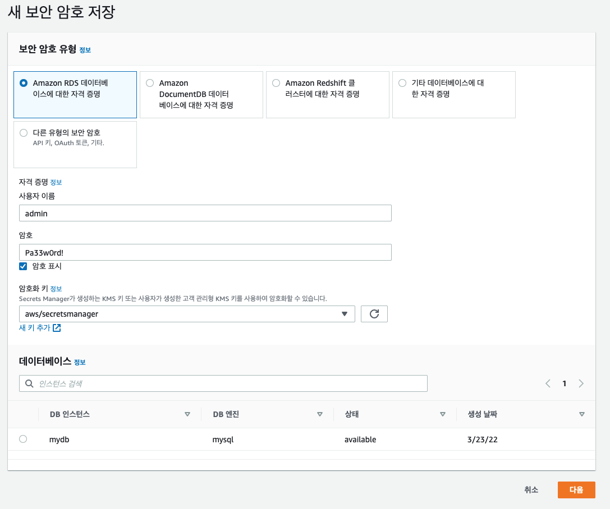
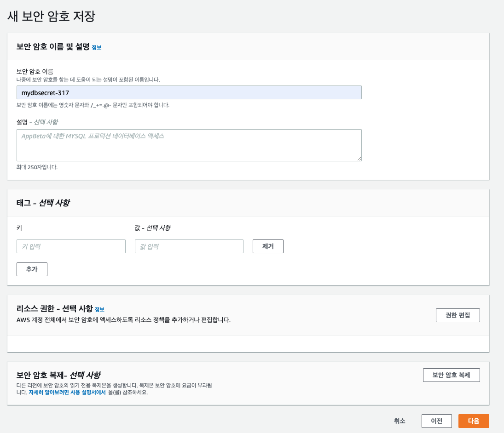
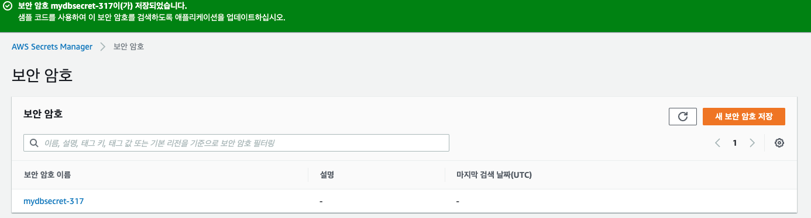
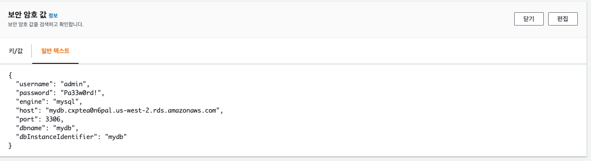
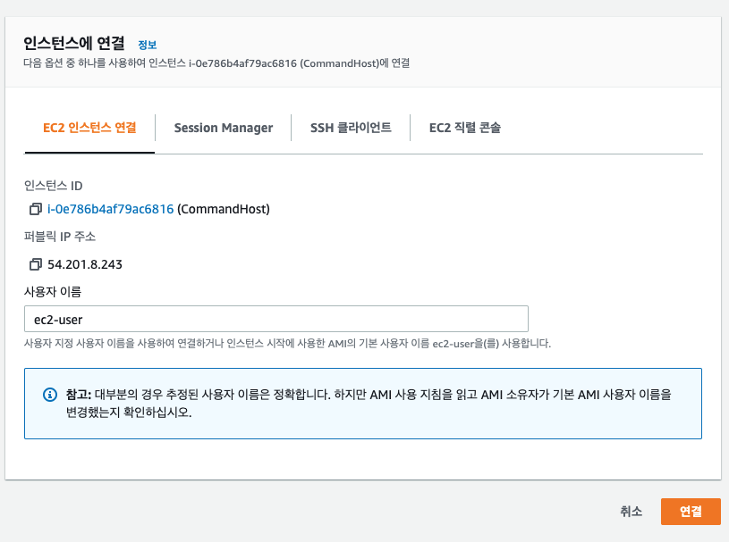
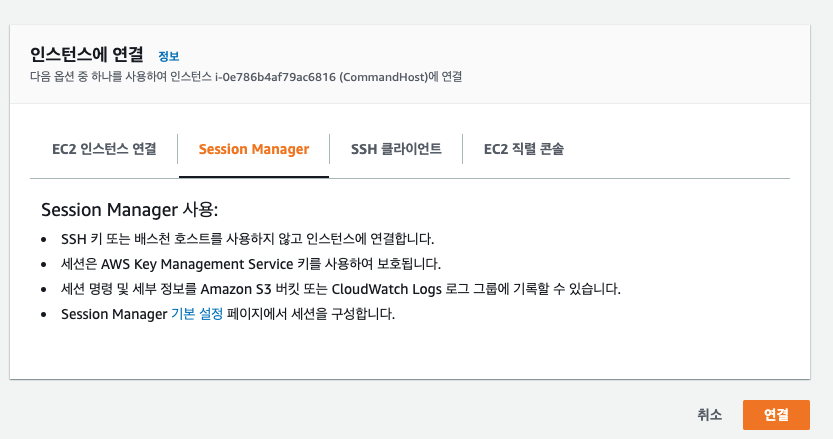

# Amazon RDS 데이터베이스 사용하기

- 다중 AZ 장애 조치 및 암호화를 사용하여 RDS 인스턴스 설정 및 구성
- Secret Manager를 통해 보안 정보 생성 및 저장





















```bash
aws secretsmanager list-secret-version-ids --secret-id mydbsecret-317

aws secretsmanager list-secret-version-ids --secret-id mydbsecret-317 --output text --query ARN

aws secretsmanager get-secret-value --secret-id arn:aws:secretsmanager:us-west-2:375266041319:secret:mydbsecret-317-1yQ8O3 --version-stage AWSCURRENT
```

```bash
secret=$(aws secretsmanager get-secret-value --secret-id arn:aws:secretsmanager:us-west-2:375266041319:secret:mydbsecret-317-1yQ8O3 | jq .SecretString | jq fromjson)
user=$(echo $secret | jq -r .username)
password=$(echo $secret | jq -r .password)
endpoint=$(echo $secret | jq -r .host)
port=$(echo $secret | jq -r .port)
```

```bash
mysql -h $endpoint -u $user -P $port -p$password mydb
```

## SSL 암호화를 사용하여 데이터베이스에 연결

```bash
cd ~
chmod 600 rds-combined-ca-bundle.pem
```

```bash
secret=$(aws secretsmanager get-secret-value --secret-id arn:aws:secretsmanager:us-west-2:375266041319:secret:mydbsecret-317-1yQ8O3 | jq .SecretString | jq fromjson)
user=$(echo $secret | jq -r .username)
password=$(echo $secret | jq -r .password)
endpoint=$(echo $secret | jq -r .host)
port=$(echo $secret | jq -r .port)

mysql -h $endpoint --ssl-ca=/home/ssm-user/rds-combined-ca-bundle.pem --ssl-verify-server-cert -u $user -P $port -p$password mydb
```

[인증서 번들 다운받는 곳](https://docs.aws.amazon.com/AmazonRDS/latest/UserGuide/UsingWithRDS.SSL.html#UsingWithRDS.SSL.RegionCertificates)

## 다중 AZ 장애 조치 테스트

### failover test

- failover 테스트를 위해 1초에 한번씩 DB 연결을 하는 프로그램 실행

```bash
pip3 install --user -r requirements.txt

python3 create_failover_sync_db.py

python3 failover_test.py --test_run_id test_run_0
```

```bash
secret=$(aws secretsmanager get-secret-value --secret-id arn:aws:secretsmanager:us-west-2:375266041319:secret:mydbsecret-317-1yQ8O3 | jq .SecretString | jq fromjson)
user=$(echo $secret | jq -r .username)
password=$(echo $secret | jq -r .password)
endpoint=$(echo $secret | jq -r .host)
port=$(echo $secret | jq -r .port)

mysql -h $endpoint --ssl-ca=/home/ssm-user/rds-combined-ca-bundle.pem --ssl-verify-server-cert -u $user -P $port -p$password mydb
```

```bash
SHOW DATABASES;

USE db_test_meter;

SELECT * FROM db_sync;
```

## Secret 교체 샘플 코드

```python
# Copyright 2018 Amazon.com, Inc. or its affiliates. All Rights Reserved.
# SPDX-License-Identifier: MIT-0

import boto3
import json
import logging
import os
import pymysql

logger = logging.getLogger()
logger.setLevel(logging.INFO)


def lambda_handler(event, context):
    """Secrets Manager RDS MySQL Handler

    This handler uses the single-user rotation scheme to rotate an RDS MySQL user credential. This rotation scheme
    logs into the database as the user and rotates the user's own password, immediately invalidating the user's
    previous password.

    The Secret SecretString is expected to be a JSON string with the following format:
    {
        'engine': <required: must be set to 'mysql'>,
        'host': <required: instance host name>,
        'username': <required: username>,
        'password': <required: password>,
        'dbname': <optional: database name>,
        'port': <optional: if not specified, default port 3306 will be used>
    }

    Args:
        event (dict): Lambda dictionary of event parameters. These keys must include the following:
            - SecretId: The secret ARN or identifier
            - ClientRequestToken: The ClientRequestToken of the secret version
            - Step: The rotation step (one of createSecret, setSecret, testSecret, or finishSecret)

        context (LambdaContext): The Lambda runtime information

    Raises:
        ResourceNotFoundException: If the secret with the specified arn and stage does not exist

        ValueError: If the secret is not properly configured for rotation

        KeyError: If the secret json does not contain the expected keys

    """
    arn = event['SecretId']
    token = event['ClientRequestToken']
    step = event['Step']

    # Setup the client
    service_client = boto3.client('secretsmanager', endpoint_url=os.environ['SECRETS_MANAGER_ENDPOINT'])

    # Make sure the version is staged correctly
    metadata = service_client.describe_secret(SecretId=arn)
    if "RotationEnabled" in metadata and not metadata['RotationEnabled']:
        logger.error("Secret %s is not enabled for rotation" % arn)
        raise ValueError("Secret %s is not enabled for rotation" % arn)
    versions = metadata['VersionIdsToStages']
    if token not in versions:
        logger.error("Secret version %s has no stage for rotation of secret %s." % (token, arn))
        raise ValueError("Secret version %s has no stage for rotation of secret %s." % (token, arn))
    if "AWSCURRENT" in versions[token]:
        logger.info("Secret version %s already set as AWSCURRENT for secret %s." % (token, arn))
        return
    elif "AWSPENDING" not in versions[token]:
        logger.error("Secret version %s not set as AWSPENDING for rotation of secret %s." % (token, arn))
        raise ValueError("Secret version %s not set as AWSPENDING for rotation of secret %s." % (token, arn))

    # Call the appropriate step
    if step == "createSecret":
        create_secret(service_client, arn, token)

    elif step == "setSecret":
        set_secret(service_client, arn, token)

    elif step == "testSecret":
        test_secret(service_client, arn, token)

    elif step == "finishSecret":
        finish_secret(service_client, arn, token)

    else:
        logger.error("lambda_handler: Invalid step parameter %s for secret %s" % (step, arn))
        raise ValueError("Invalid step parameter %s for secret %s" % (step, arn))


def create_secret(service_client, arn, token):
    """Generate a new secret

    This method first checks for the existence of a secret for the passed in token. If one does not exist, it will generate a
    new secret and put it with the passed in token.

    Args:
        service_client (client): The secrets manager service client

        arn (string): The secret ARN or other identifier

        token (string): The ClientRequestToken associated with the secret version

    Raises:
        ValueError: If the current secret is not valid JSON

        KeyError: If the secret json does not contain the expected keys

    """
    # Make sure the current secret exists
    current_dict = get_secret_dict(service_client, arn, "AWSCURRENT")

    # Now try to get the secret version, if that fails, put a new secret
    try:
        get_secret_dict(service_client, arn, "AWSPENDING", token)
        logger.info("createSecret: Successfully retrieved secret for %s." % arn)
    except service_client.exceptions.ResourceNotFoundException:
        # Generate a random password
        passwd = service_client.get_random_password(ExcludeCharacters='/@"\'\\')
        current_dict['password'] = passwd['RandomPassword']

        # Put the secret
        service_client.put_secret_value(SecretId=arn, ClientRequestToken=token, SecretString=json.dumps(current_dict), VersionStages=['AWSPENDING'])
        logger.info("createSecret: Successfully put secret for ARN %s and version %s." % (arn, token))


def set_secret(service_client, arn, token):
    """Set the pending secret in the database

    This method tries to login to the database with the AWSPENDING secret and returns on success. If that fails, it
    tries to login with the AWSCURRENT and AWSPREVIOUS secrets. If either one succeeds, it sets the AWSPENDING password
    as the user password in the database. Else, it throws a ValueError.

    Args:
        service_client (client): The secrets manager service client

        arn (string): The secret ARN or other identifier

        token (string): The ClientRequestToken associated with the secret version

    Raises:
        ResourceNotFoundException: If the secret with the specified arn and stage does not exist

        ValueError: If the secret is not valid JSON or valid credentials are found to login to the database

        KeyError: If the secret json does not contain the expected keys

    """
    # First try to login with the pending secret, if it succeeds, return
    pending_dict = get_secret_dict(service_client, arn, "AWSPENDING", token)
    conn = get_connection(pending_dict)
    if conn:
        conn.close()
        logger.info("setSecret: AWSPENDING secret is already set as password in MySQL DB for secret arn %s." % arn)
        return

    # Now try the current password
    conn = get_connection(get_secret_dict(service_client, arn, "AWSCURRENT"))
    if not conn:
        # If both current and pending do not work, try previous
        try:
            conn = get_connection(get_secret_dict(service_client, arn, "AWSPREVIOUS"))
        except service_client.exceptions.ResourceNotFoundException:
            conn = None

    # If we still don't have a connection, raise a ValueError
    if not conn:
        logger.error("setSecret: Unable to log into database with previous, current, or pending secret of secret arn %s" % arn)
        raise ValueError("Unable to log into database with previous, current, or pending secret of secret arn %s" % arn)

    # Now set the password to the pending password
    try:
        with conn.cursor() as cur:
            cur.execute("SET PASSWORD = PASSWORD(%s)", pending_dict['password'])
            conn.commit()
            logger.info("setSecret: Successfully set password for user %s in MySQL DB for secret arn %s." % (pending_dict['username'], arn))
    finally:
        conn.close()


def test_secret(service_client, arn, token):
    """Test the pending secret against the database

    This method tries to log into the database with the secrets staged with AWSPENDING and runs
    a permissions check to ensure the user has the correct permissions.

    Args:
        service_client (client): The secrets manager service client

        arn (string): The secret ARN or other identifier

        token (string): The ClientRequestToken associated with the secret version

    Raises:
        ResourceNotFoundException: If the secret with the specified arn and stage does not exist

        ValueError: If the secret is not valid JSON or valid credentials are found to login to the database

        KeyError: If the secret json does not contain the expected keys

    """
    # Try to login with the pending secret, if it succeeds, return
    conn = get_connection(get_secret_dict(service_client, arn, "AWSPENDING", token))
    if conn:
        # This is where the lambda will validate the user's permissions. Uncomment/modify the below lines to
        # tailor these validations to your needs
        try:
            with conn.cursor() as cur:
                cur.execute("SELECT NOW()")
                conn.commit()
        finally:
            conn.close()

        logger.info("testSecret: Successfully signed into MySQL DB with AWSPENDING secret in %s." % arn)
        return
    else:
        logger.error("testSecret: Unable to log into database with pending secret of secret ARN %s" % arn)
        raise ValueError("Unable to log into database with pending secret of secret ARN %s" % arn)


def finish_secret(service_client, arn, token):
    """Finish the rotation by marking the pending secret as current

    This method finishes the secret rotation by staging the secret staged AWSPENDING with the AWSCURRENT stage.

    Args:
        service_client (client): The secrets manager service client

        arn (string): The secret ARN or other identifier

        token (string): The ClientRequestToken associated with the secret version

    """
    # First describe the secret to get the current version
    metadata = service_client.describe_secret(SecretId=arn)
    current_version = None
    for version in metadata["VersionIdsToStages"]:
        if "AWSCURRENT" in metadata["VersionIdsToStages"][version]:
            if version == token:
                # The correct version is already marked as current, return
                logger.info("finishSecret: Version %s already marked as AWSCURRENT for %s" % (version, arn))
                return
            current_version = version
            break

    # Finalize by staging the secret version current
    service_client.update_secret_version_stage(SecretId=arn, VersionStage="AWSCURRENT", MoveToVersionId=token, RemoveFromVersionId=current_version)
    logger.info("finishSecret: Successfully set AWSCURRENT stage to version %s for secret %s." % (version, arn))


def get_connection(secret_dict):
    """Gets a connection to MySQL DB from a secret dictionary

    This helper function tries to connect to the database grabbing connection info
    from the secret dictionary. If successful, it returns the connection, else None

    Args:
        secret_dict (dict): The Secret Dictionary

    Returns:
        Connection: The pymysql.connections.Connection object if successful. None otherwise

    Raises:
        KeyError: If the secret json does not contain the expected keys

    """
    # Parse and validate the secret JSON string
    port = int(secret_dict['port']) if 'port' in secret_dict else 3306
    dbname = secret_dict['dbname'] if 'dbname' in secret_dict else None

    # Try to obtain a connection to the db
    try:
        conn = pymysql.connect(secret_dict['host'], user=secret_dict['username'], passwd=secret_dict['password'], port=port, db=dbname, connect_timeout=5, ssl={'ca': './rds-combined-ca-bundle.pem'})
        return conn
    except pymysql.OperationalError:
        return None


def get_secret_dict(service_client, arn, stage, token=None):
    """Gets the secret dictionary corresponding for the secret arn, stage, and token

    This helper function gets credentials for the arn and stage passed in and returns the dictionary by parsing the JSON string

    Args:
        service_client (client): The secrets manager service client

        arn (string): The secret ARN or other identifier

        token (string): The ClientRequestToken associated with the secret version, or None if no validation is desired

        stage (string): The stage identifying the secret version

    Returns:
        SecretDictionary: Secret dictionary

    Raises:
        ResourceNotFoundException: If the secret with the specified arn and stage does not exist

        ValueError: If the secret is not valid JSON

    """
    required_fields = ['host', 'username', 'password']

    # Only do VersionId validation against the stage if a token is passed in
    if token:
        secret = service_client.get_secret_value(SecretId=arn, VersionId=token, VersionStage=stage)
    else:
        secret = service_client.get_secret_value(SecretId=arn, VersionStage=stage)
    plaintext = secret['SecretString']
    secret_dict = json.loads(plaintext)

    # Run validations against the secret
    if 'engine' not in secret_dict or secret_dict['engine'] != 'mysql':
        raise KeyError("Database engine must be set to 'mysql' in order to use this rotation lambda")
    for field in required_fields:
        if field not in secret_dict:
            raise KeyError("%s key is missing from secret JSON" % field)

    # Parse and return the secret JSON string
    return secret_dict
```

### failover_sync_db.py

```python
#!/usr/bin/env python3

import argparse
import logging

from db_test_meter.database import Database
from db_test_meter.util import init_logger, collect_user_input, AppConfig


def create_db(db: Database) -> None:
    """
    Utility to create the db and table for the sync check
    :param db:
    :return:
    """
    try:
        log.debug(f'creating database {AppConfig.TEST_DB_NAME}')
        db.run_query(f"DROP DATABASE IF EXISTS {AppConfig.TEST_DB_NAME}")
        db.run_query(f"CREATE DATABASE IF NOT EXISTS {AppConfig.TEST_DB_NAME}")
        log.debug(f'creating table {AppConfig.TEST_DB_TABLE}')
        db.run_query(
            f"CREATE TABLE {AppConfig.TEST_DB_NAME}.{AppConfig.TEST_DB_TABLE} (`test_run_id` varchar(50) NOT NULL, `index_id` int(10) unsigned NOT NULL, `created` int(8) NOT NULL)")
        print(f'Database {AppConfig.TEST_DB_NAME} created')
        print(f'Table {AppConfig.TEST_DB_NAME}.{AppConfig.TEST_DB_TABLE} created')
    except Exception as e:
        print(f'There was an error: {e}')


parser = argparse.ArgumentParser(
    'simple utility to create the db and table used by failover_test.py. Usage: ./create_failover_sync_db.py')
parser.add_argument('--debug', action='store_true')
init_logger(debug=parser.parse_args().debug)
log = logging.getLogger()

print('This will destroy and recreate sync database and tracking table')
if (input("enter y to continue, n to exit [n]: ") or 'n').lower() == 'y':
    db_connection_metadata = collect_user_input()
    db = Database(db_connection_metadata)
    create_db(db)
else:
    print('exiting...')
```

### failover_test.py

```python
#!/usr/bin/env python3

import argparse
import logging
import pprint
import sys
import time
import traceback

from db_test_meter.database import Database
from db_test_meter.test_run import TestRun
from db_test_meter.util import init_logger, collect_user_input

parser = argparse.ArgumentParser('This will gather metrics of a failover event')
parser.add_argument('--test_run_id', metavar='<test run id>', type=str, nargs='?', required=True,
                    help='a unique identifier for this test run')
parser.add_argument('--loop_time', metavar='<seconds>', type=float, nargs='?', default='.5',
                    help='sleep is used to insure this minimum loop time in sec. Can be decimal (defaults to .5')
parser.add_argument('--debug', action='store_true')
args = parser.parse_args()
test_run_id = args.test_run_id
loop_time = args.loop_time
if loop_time <= 0:
    print('Loop time must be >= 0, exiting...')
    exit(1)
init_logger(debug=args.debug)
log = logging.getLogger()

db_connection_metadata = collect_user_input()
db = Database(db_connection_metadata)
test_runner = TestRun(db)

if not test_runner.test_db_connection():
    log.fatal('Initial db connection failed.  Check you connection setup and try again. Exiting...')
    exit(1)

pre_failure_db_node_hostname = test_runner.get_db_node_hostname()
print(f'Test starting, initial Db node hostname: {pre_failure_db_node_hostname}')
post_failure_db_node_hostname = None

try:
    while True:
        loop_start_time = time.time()
        test_runner.ensure_minumum_loop_time(loop_time, loop_start_time, test_runner.prev_loop_end_time)
        if test_runner.db_node_heartbeat(test_run_id):
            if test_runner.recovery_detected():
                test_runner.failure_condition_end_time = time.time()
                post_failure_db_node_hostname = test_runner.get_db_node_hostname()
                test_runner.prev_loop_end_time = time.time()
                break
        test_runner.prev_loop_end_time = time.time()
except Exception as e:
    print(f'There was an unexpected exception: {e}')
    print("-" * 60)
    traceback.print_exc(file=sys.stdout)
    print("-" * 60)
    exit(1)
finally:
    test_runner.shutdown()


pp = pprint.PrettyPrinter(indent=2)
print('\n========================================')
print(f'Total Db connection attempts: {test_runner.success_connect_count + test_runner.failed_connect_count}')
print(f'Successful Db connections: {test_runner.success_connect_count}')
print(f'Failed Db connections: {test_runner.failed_connect_count}')
print(f'failure_start_time: {time.ctime(test_runner.failure_condition_start_time)}')
print(f'failure_end_time: {time.ctime(test_runner.failure_condition_end_time)}')
duration = int(test_runner.failure_condition_end_time - test_runner.failure_condition_start_time)
print(f'failure condition duration: {duration} seconds')
print(f'Last inserted sync record id on initial primary db node: {test_runner.last_inserted_heartbeat_index}')
print(f'Pre-failure Db node hostname: {pre_failure_db_node_hostname}')
print(f'Post-failure Db node hostname: {post_failure_db_node_hostname}')
print(f'Newest 5 sync records in current primary db node:')
pp.pprint(test_runner.get_last_sync_records(test_run_id, 5))
```
