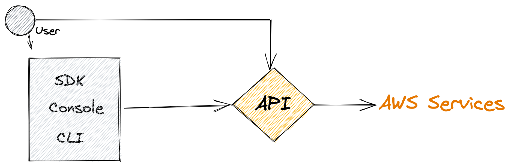

# Developing On AWS

## Overview



## 모듈 1: AWS 클라우드 컴퓨팅

- 인프라를 하드웨어가 아닌 소프트웨어로 간주하고 사용할 수 있습니다.

### 비관리형 vs 관리형

- 비관리형: 사용자가 확장, 내결함성 및 가용성을 관리 ( EC2 가반으로 아키텍쳐로 설계 )
- 관리형 : 일반적으로 확장, 내결함성 및 가용성이 서비스에 내장

### 클라우드 배포 모델

- 올인 클라우드 - 모놀리식으로 그대로 올리기
- 하이브리드 - 마이크로서비스로 분해해서 올리기

### 마이크로 서비스의 모범사례

- 구성요소를 오류 없이 변경하십시오.
- 간단한 API를 사용하십시오.
- 상태 비저장

### 아키텍처의 발전

#### EC2

- 규모: 가상머신
- 추상화: 하드웨어

#### ECS

- 규모: 작업
- 추상화: 운영체제

#### Lambda

- 규모: 함수
- 추상화: 실행시간

### 인프라 개요

#### 리전선택

1. 거버넌스
2. 근접성
3. 사용가능한 서비스
4. 비용

### ELB

- unhealty가 뜬다? => 보안그룹 문제

### AS

- 수동조정
- 예약된 조정
- 동적 조정

### Developing on AWS

1. AWS 자격증명 획득
2. 개발 환경 설치
3. 특정언어용 AWS SDK 설치
4. AWS 자격 증명 설정

### 개발자 도구

#### IDE

- [x] AWS Cloud9
- [ ] VS
- [ ] Eclipse
- [ ] PyCharm

#### 보완툴

- AWS X-Ray

### 예외 및 오류

- 400: 애플리케이션의 오류
- 500: 서버 내부 오류, 작업 재시도

### 관리도구

- CloudWatch
- CloudTrail

### CloudWatch

- EC2뿐만아닌 Container, Lambda로 추적 가능하다.
- EventBridge : A

#### CloudWatch가 하는 작업

- 지표 (CPU, Memory, Disk I/O, Network)
- 로그/이벤트 ( 애플리케이션 로그 이펜트 및 가용성에 대응 )
- 경보 ( EC2 인스턴스 플릿을 자동으로 조정 ) -> SNS, AutoScaling
- 대시보드 ( 운영 상태를 확인하고 문제를 식별)

### CloudTrail

#### CloudTrail 통합

- AWS API 호출한 내용들을 기록하고 있음
- Console login/logout같은 것은 AWS API는 아니지만 CloudTrail이 추적한다
- Audit 용도
- 90일 정도까지만 저장
- 영구적으로 저장하기 위해서 S3에 저장
- 실습환경의 S3에 들어가 보면 기본적으로 CloudTrail하나 있고 CloudFormation이 만든게 하나 있음
- AWS Configㅇ -> 우리회사의 "규정"을 잘 지키고 있는지 확인 해줄수 있는 서비스

## 모듈 3: IAM 소개

- IAM
- Organizations
- Cognito

### 인증

1. user
2. group
3. role - 임시자격증명, 권한 위임 ( AWS 서비스에 대한 권한만 가능, Account간 또는 AWS 서비스에 권한 빌려주기 )

### 권한

1. policy

### Organizations

[AWS Organizations](https://docs.aws.amazon.com/ko_kr/organizations/latest/userguide/orgs_getting-started_concepts.html)

- Organize ( Tree )
- Account
  - Management
  - Member => Resource
- OU
- Policy ( SCP, Tag Policy ... ) => 태그 강제화 시킬수 있다.

### Cognito

1. User Pool ( 어플리케이션의 사용자를 관리 )
2. Identity Pool ( 유저풀에서 받은 토큰을 IAM Role을 교환해주는 도구 )

### Group vs Organizations

- An IAM user group is a collection of IAM users
- 하나의 User는 여러 Group을 가질 수 있다.
- Organizations는 여러 Account의 집합이다.

### 인증방법

- Username / pwd : Console
- AKID/ASK : CLI, SDK, API ( Active/InActive 가능)

### Amazon 리소스 이름

- S3 리소스 이름이 s3:::bucket_name 인 이유는 버킷이름이 글러벌하게 유니크해야하기 때문에 S3는 리전도 구분할 필요 없음

### IAM 권한 유형

#### 자격 증명 기반 권한

#### 리소스 기반 권한

- Principal 추가 ( ex: {"AWS": "111122223333"}AWS 계정중에 특정 사용자만 허용)

### AWS의 인증 개요

1. AWS 인증 - 환경을 빌드하는 경우
2. 리소스 인증 - 사용자가 사진을 찍어 S3에 올리는 경우
3. 애플리케이션 인증 ( IAM X ) - 사용자가 앱에 로그인 할 때
4. 데이터베이스 인증 ( IAM X ) - DB안에 접근하는거

### 자격 증명 설정

.aws/credentials => aws_access_key, aws_secret_access_key

- 자격증명파일 사용하는 것보다 IAM 역할 사용을 선호한다
- STS의 임시 자격 증명 사용 ( AssumeRole을 사용하면 STS를 호출하게 된다. )

#### 해서는 안 될 일

- 루트 계정 자격 증명 사용
- 코드에 AWS 자격 증명 삽입
- Git, Wiki등에 공개된 위치에 자격증명 저장

### 보안 자격 증명: 운선순이 순서

- 하드코딩 => 환경변수 => 자격증명 파일의 기본 자격 증명 프로필 (.aws/credentials) => EC2 인스턴스 역할 (\* 권장)
- 하드코딩으로 AK,SK 가 있다면 인스턴스 Role이 무시됨( 하드코딩이 더 우선순위가 높기 때문 )
- IAM Role을 사용하기로 했다면 하드코딩, 환경변수, 자격 증명 프로필을 없애야 한다.

### 실습 내용

1. 역할 생성
2. 정책생성
3. EC2에 역할 설정 ( Instance Profile )
4. 엔드포인트가 EC2가 S3로 가게 될때, Role이 자동으로 AK, SK, ST를 만들어주고, 어플리케이션이 S3에 접근 할수 있다.
5. 확인하고 싶다면 Metadata를 확인하면 된다. [see more](https://docs.aws.amazon.com/ko_kr/AWSEC2/latest/UserGuide/iam-roles-for-amazon-ec2.html)

```bash
  curl http://169.254.169.254/latest/meta-data/iam/security-credentials/role_name
```

- WINDOW는 RDP나 콰카몰( 브라우저 ) 로 접근 가능하다.

#### 구아콰몰

id : student ( 하드 코딩 )
pwd: 왼쪽 패널의 AdministerPassword

## 모듈 5: S3로 스토리스 솔루션 개발

- EC2와 EFS를 연결하고자할때는 Mount Target을 만들어야 한다.
- Mount Target은 AZ별로 하나씩만 만들면 된다.
- EFS는 파일을 공유하기 위해 사용한다.
- EC2하나에 여러 EBS는 가능
- EBS하나에 EC2개수는 제한적
- EBS는 16TB, EFS는 무제한
- S3는 단독으로 사용 가능함
- EFS는 S3에 비해 비싸다
- 람다/쿠버네티스랑 EFS랑 연동하는 기능이 있다.
- S3도 암호화가 가능하다 ( 파일은 암호가능, 메타데이터는 암호화 불가능 )
- S3의 객체 잠금기능을 사용하기 위해서는 반드시 버전관리를 사용해야한다.

### S3 사용사례

- 콘텐츠 저장 및 배포
- 백업 및 아카이빙
- 빅데이터 분석
- 재해 복구
- 정적 웹 사이트 호스팅

### S3 객체의 URL

- 가상 호스팅 방식 \*
- 이전 경로 스타일 URL
