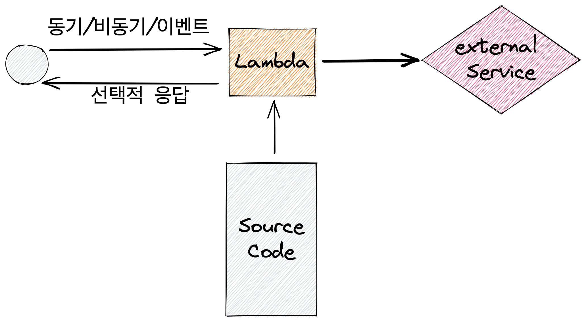

# Developing On AWS

## Overview


## 모듈 1: AWS 클라우드 컴퓨팅

- 인프라를 하드웨어가 아닌 소프트웨어로 간주하고 사용할 수 있습니다.

### 비관리형 vs 관리형

- 비관리형: 사용자가 확장, 내결함성 및 가용성을 관리 ( EC2 가반으로 아키텍쳐로 설계 )
- 관리형 : 일반적으로 확장, 내결함성 및 가용성이 서비스에 내장

### 클라우드 배포 모델

- 올인 클라우드 - 모놀리식으로 그대로 올리기
- 하이브리드 - 마이크로서비스로 분해해서 올리기

### 마이크로 서비스의 모범사례

- 구성요소를 오류 없이 변경하십시오.
- 간단한 API를 사용하십시오.
- 상태 비저장

### 아키텍처의 발전

#### EC2

- 규모: 가상머신
- 추상화: 하드웨어

#### ECS

- 규모: 작업
- 추상화: 운영체제

#### Lambda

- 규모: 함수
- 추상화: 실행시간

### 인프라 개요

#### 리전선택

1. 거버넌스
2. 근접성
3. 사용가능한 서비스
4. 비용

### ELB

- unhealty가 뜬다? => 보안그룹 문제

### AS

- 수동조정
- 예약된 조정
- 동적 조정

### Developing on AWS

1. AWS 자격증명 획득
2. 개발 환경 설치
3. 특정언어용 AWS SDK 설치
4. AWS 자격 증명 설정

### 개발자 도구

#### IDE

- [x] AWS Cloud9
- [ ] VS
- [ ] Eclipse
- [ ] PyCharm

#### 보완툴

- AWS X-Ray

### 예외 및 오류

- 400: 애플리케이션의 오류
- 500: 서버 내부 오류, 작업 재시도

### 관리도구

- CloudWatch
- CloudTrail

### CloudWatch

- EC2뿐만아닌 Container, Lambda로 추적 가능하다.
- EventBridge : A

#### CloudWatch가 하는 작업

- 지표 (CPU, Memory, Disk I/O, Network)
- 로그/이벤트 ( 애플리케이션 로그 이펜트 및 가용성에 대응 )
- 경보 ( EC2 인스턴스 플릿을 자동으로 조정 ) -> SNS, AutoScaling
- 대시보드 ( 운영 상태를 확인하고 문제를 식별)

### CloudTrail

#### CloudTrail 통합

- AWS API 호출한 내용들을 기록하고 있음
- Console login/logout같은 것은 AWS API는 아니지만 CloudTrail이 추적한다
- Audit 용도
- 90일 정도까지만 저장
- 영구적으로 저장하기 위해서 S3에 저장
- 실습환경의 S3에 들어가 보면 기본적으로 CloudTrail하나 있고 CloudFormation이 만든게 하나 있음
- AWS Configㅇ -> 우리회사의 "규정"을 잘 지키고 있는지 확인 해줄수 있는 서비스

## 모듈 3: IAM 소개

- IAM
- Organizations
- Cognito

### 인증

1. user
2. group
3. role - 임시자격증명, 권한 위임 ( AWS 서비스에 대한 권한만 가능, Account간 또는 AWS 서비스에 권한 빌려주기 )

### 권한

1. policy

### Organizations

[AWS Organizations](https://docs.aws.amazon.com/ko_kr/organizations/latest/userguide/orgs_getting-started_concepts.html)

- Organize ( Tree )
- Account
  - Management
  - Member => Resource
- OU
- Policy ( SCP, Tag Policy ... ) => 태그 강제화 시킬수 있다.

### Cognito

1. User Pool ( 어플리케이션의 사용자를 관리 )
2. Identity Pool ( 유저풀에서 받은 토큰을 IAM Role을 교환해주는 도구 )

### Group vs Organizations

- An IAM user group is a collection of IAM users
- 하나의 User는 여러 Group을 가질 수 있다.
- Organizations는 여러 Account의 집합이다.

### 인증방법

- Username / pwd : Console
- AKID/ASK : CLI, SDK, API ( Active/InActive 가능)

### Amazon 리소스 이름

- S3 리소스 이름이 s3:::bucket_name 인 이유는 버킷이름이 글러벌하게 유니크해야하기 때문에 S3는 리전도 구분할 필요 없음

### IAM 권한 유형

#### 자격 증명 기반 권한

#### 리소스 기반 권한

- Principal 추가 ( ex: {"AWS": "111122223333"}AWS 계정중에 특정 사용자만 허용)

### AWS의 인증 개요

1. AWS 인증 - 환경을 빌드하는 경우
2. 리소스 인증 - 사용자가 사진을 찍어 S3에 올리는 경우
3. 애플리케이션 인증 ( IAM X ) - 사용자가 앱에 로그인 할 때
4. 데이터베이스 인증 ( IAM X ) - DB안에 접근하는거

### 자격 증명 설정

.aws/credentials => aws_access_key, aws_secret_access_key

- 자격증명파일 사용하는 것보다 IAM 역할 사용을 선호한다
- STS의 임시 자격 증명 사용 ( AssumeRole을 사용하면 STS를 호출하게 된다. )

#### 해서는 안 될 일

- 루트 계정 자격 증명 사용
- 코드에 AWS 자격 증명 삽입
- Git, Wiki등에 공개된 위치에 자격증명 저장

### 보안 자격 증명: 운선순이 순서

- 하드코딩 => 환경변수 => 자격증명 파일의 기본 자격 증명 프로필 (.aws/credentials) => EC2 인스턴스 역할 (\* 권장)
- 하드코딩으로 AK,SK 가 있다면 인스턴스 Role이 무시됨( 하드코딩이 더 우선순위가 높기 때문 )
- IAM Role을 사용하기로 했다면 하드코딩, 환경변수, 자격 증명 프로필을 없애야 한다.

### 실습 내용

1. 역할 생성
2. 정책생성
3. EC2에 역할 설정 ( Instance Profile )
4. 엔드포인트가 EC2가 S3로 가게 될때, Role이 자동으로 AK, SK, ST를 만들어주고, 어플리케이션이 S3에 접근 할수 있다.
5. 확인하고 싶다면 Metadata를 확인하면 된다. [see more](https://docs.aws.amazon.com/ko_kr/AWSEC2/latest/UserGuide/iam-roles-for-amazon-ec2.html)

```bash
  curl http://169.254.169.254/latest/meta-data/iam/security-credentials/role_name
```

- WINDOW는 RDP나 콰카몰( 브라우저 ) 로 접근 가능하다.

#### 구아콰몰

id : student ( 하드 코딩 )
pwd: 왼쪽 패널의 AdministerPassword

## 모듈 5: S3로 스토리스 솔루션 개발

- EC2와 EFS를 연결하고자할때는 Mount Target을 만들어야 한다.
- Mount Target은 AZ별로 하나씩만 만들면 된다.
- EFS는 파일을 공유하기 위해 사용한다.
- EC2하나에 여러 EBS는 가능
- EBS하나에 EC2개수는 제한적
- EBS는 16TB, EFS는 무제한
- S3는 단독으로 사용 가능함
- EFS는 S3에 비해 비싸다
- 람다/쿠버네티스랑 EFS랑 연동하는 기능이 있다.
- S3도 암호화가 가능하다 ( 파일은 암호가능, 메타데이터는 암호화 불가능 )
- S3의 객체 잠금기능을 사용하기 위해서는 반드시 버전관리를 사용해야한다.

### S3 사용사례

- 콘텐츠 저장 및 배포
- 백업 및 아카이빙
- 빅데이터 분석
- 재해 복구
- 정적 웹 사이트 호스팅

### S3 객체의 URL

- 가상 호스팅 방식 \*
- 이전 경로 스타일 URL

```text
퍼블릭 라우팅 테이블이
10.0.0.0/16 local
0.0.0.0/0 nat
이렇게 설정되어있다면,
10.255.255.255 라는 이름의 외부 ip로 연결하려고 시도한다면
internet으로 못나가고 VPC 내부에서 찾게 되나요? => 그렇다
```

## 모듈 5: Amazon Simple Storage Service(S3)로 스토리지 솔루션

- 리전내에 3개의 복제본 컴퓨터에 분산 저장함
- 최종 일관성 : 파일을 변경해도 바로 바뀌지 않을 수 있음
- 강력한 일관성 : 현재는 강력한 일관성으로 제공됨
- DynamoDB에서는 최종 일관성과 강력한 일관성을 지원한다.
- 버킷 이름은 전역적으로 고유해야 한다. ( 글로벌하게 )

### 객체 관련 작업

#### PUT

- 한번에 올리기
- 멀티파트로 올리기 ( 100MB 이상일 경우 권장 )

#### GET

- 전체
- 바이트 단위

#### Select

- 일부만 가져오기
- 하나의 파일만 가능함
- 여겨개 파일 할때는 Athena (SQL)로 가능 - 나중에 EKS쓸때 로깅하는 방법으로 사용

#### 키 리스팅

- 2018에 대한 키나열
- 2018 점수 요약에 대한 키 나열
- 버킷이름: score

### 미리 서명된 URL

- 보안 자격 증명
- 버킷 이름
- 객체 키
- HTTP 메서드
- 만료 날짜 및 시간

### 데이터 암호화

- 전송 데이터 암호화 ( TLS, 클라이언트 측 암호화)
- static 에서 올리면 http -> https로 불가능
- 서버에 저장된 데이터 보호 ( SSE-S3(AES256), SSE-KMS( 대칭/비대칭 ), SSE-C(고객 제공 키))

### S3 액세스 제어 목록

- 객체 또는 버킷 수준에서 낮은 수준으로 세분화된 사용자 권한을 부여
- ACL는 Account 단위만 권한설정 가능함 ( 별로 권장하지 않음 => IAM 설정 권장 )
- make public (=> ACL 설정한것임)
- 버킷정책 (Principal 키를 이용해서도 가능)
- CORS( xml/json 둘다 지원 )

### 성능

- 비용은 API호출이기 때문에 불필요한 요청을 안하는 것이 좋다.
- 네트워크 지연시간 => 무조건 CloudFront를 사용하는 것이 좋음

### 데이터 무결성

- 데이터가 전송 중 손상되지 않았는지 확인합니다.

## 모듈 6: Amazon DynamoDB로 유연한 NoSQL솔루션 개발

### RDS

- 자동백업 => 1주일 : Snapshot
- AutoScaling으로는 스토리지 축소는 불가능하고 확장만 가능하다.
- 수평확장 : Read Replica ( Aurora는 15개까지 가능하다. )
- MultiAZ

### Dynamo DB

### 읽기 및 쓰기 처리량

- RCU 100RCU -> 4KB | 강력한 읽기 1배, 최종적 읽기는 1/2배
- 강력한 읽기 : 비용이 더 비쌈.
- WCU: 비용 저장 , 요청(프로비저닝, 온디맨드)
- 100wcu - > 초당 1KB 100건 | 프로비저닝에선 이상 쓰면 에러남, 프로비저닝은 오토스케일링

### 보조 인덱스

- 기본 테이블이 있어야함 -> 보조 인덱스를 만듦
- 다른 기준으로 조건 검색을 하기 위해서

#### 로컬 보조 인덱스

- 파티션 키를 그대로 가져옴
- 같은 파티션을 쓰게 됌
- 테이블 만들때만 만들수 있고 삭제 할 수 없음

#### 글로벌 보조 인덱스

- 다른쪽에 있는 키로 파티션 키로 사용함
- 별도의 테이블
  1- 삭제 가능

- ConsistentRead를 주면 "강력한 읽기"고 아니면 "최종적 읽기"

### 속성 이름과 값 자리 표시자

- ExpressionAttributeNames
- ExpressionAttributeValues
- \# 예약어 표시자, : 리터럴

### 조건부 쓰기 작업

- ConditionExpression

### 반환되는 데이터 양을 제한

- DynamoDB는 무제한
- 기본적으로 1MB의 데이터 pagination 제한
- Limit 파라미터는 쿼리 또는 스캔 작업에서 반환하는 최대 항목 수를 지정

### 배치 작업

- BatchGetItem: 여러 테이블에서 최대 100개의 항목으로 이루어진 데이터를 최대 16MB 까지 읽습니다
- BatchWriteItem: 여러 테이블에서 최대 25건의 put또는 delete 요청으로 이루어진 데이터를 최대 16MB까지 씁니다

- 배치에서 하나의 요청이 실패하면 해당하는 작업 실패합니다.
- 실패한 작업은 UnprecessedItems 응답 파라미터에서 반환됨

### 트랜잭션 작업

- TransactionWriteItems
- TransactionGetItems
- 한 작업 실패하면 전체 작업이 실패

### 핫 데이터와 콜드 데이터

- 자주 액세스하는 데이터를 자주 액세스하지 않는 데이터와 분리
- "TTL" 설정 ( 일정시간 이후 자동 삭제 )

### 글로벌 보조 인덱스 (2)

- 최종 일관성 읽기 복제본만 가능

### 배치작업의 오류처리

- 지수 백오프 알고리즘 사용
- 계속 재시도 하는게 아니라 1초 2초 4초 8초 단위로 재시도 ( 직접 구현 해야함 )

#### 배치작업의 오류코드

- UnprocessedKeys
- UnprocessedItems

### 처리량 예외 처리

- ProvisionedThroughputExceededException
- 처리량 계산을 확인하고 적절한 처리량을 프로비저닝 한다.
- 온디맨드가 더 비싸다 대충 프로비저닝하고 오토 스케일리이랑 같이 쓰는게 좋다.

## 모듈 7: Lambda

### 서버리스 플랫폼

- Role 설정해야함
- CloudeWatch는 기본적으로 활성화
- X-Ray는 직접 활성화 시켜야함



### 사용

- 자체 코드 사용가능
- 유연한 사용
- 단순한 리소스 모델 ( 128MB ~ 10GB, CPU 및 네트워크가 비례적으로 할당됨 )
- 유연한 권한부여
- 함수 작성 ( WYSIWYG 편집기 JAVA는 안됨)

### 구조

- handler 함수 - 실핼될 함수, 가장 먼저 호출될 함수, 파라미터 2개 넘어옴 ( 이벤트, 컨텍스트)
- 이벤트 객체
- 컨텍스트객체

### 개발 및 배포

1. 코드
2. 함수 생성
3. IAM Role 생성

### 람다 실행 모델

1. 동기식 - API Gateway
2. 비동기식(이벤트) - S3, SNS, ...etc
3. 스트림, 이벤트소스 기반 - SQS, DynamoDB, MQ, Kinesis

- DynamoDB에다 데이터 추가시 바로 람다 바로 호출 불가능
- 매핑이 필요함, 람다가 계속 DynamoDB를 폴링함

### 람다의 권한

- 실행 권한: 람다함수가 소스코드에 의해서 API를 호출할 때 ( 함수 내부 ) - 기본으로 CloudWatch, X-ray를 쓸 수 있음 => Execution Role
- 호출 권한: 람다 리소스 => Resource 기반 정책 "이벤트소스기반은 호출 권한이 없다"

### 풀 이벤트 모델

- DLQ ( SQS ) - 재시도했는데 성공 못한다면 DLQ로 옮겨짐 ( DLQ 를 보고 뭐가 문제인지 확인 가능 )

### 푸시 이벤트 모델

- DLQ, 대상 ( 성공, 실패 )

### 비용

- 100ms 올림 -> 1ms 단위

### 제한

- 인바운드 네트워크 연결은 AWS Lambda에서 차단

### 버전 관리 및 별칭

- 버전은 코드로 관리가 좀 어려움
- 별칭 설정 가능
- 별도의 arn 제공

### 람다 계층

- 여러 함수에서 공유되는 코드 및 데이터를 중앙에서 관리
- 5개의 계증
- 배포크기를 작게 하기 위함

### 모범 사례

- 핸들러 함수는 별도로 만들기
- 실행 컨텍스트 재사용을 활용
- 환경변수 사용

### 경보 및 지표

- Lambda 지표 및 CloudWatch 경보를 사용
- 로깅 라이브러리를 사용

## 모듈 8: API Gateway

- DDoS 보호 ( WAF web application firewall, L7 단의 방어기능 제공 )
- API 프론트엔드
- 백엔드에 대한 요청 인증 및 권한부여
- 타사 개발자가 API 사용량 조절
- DNS으로 제공 ( ip가 여러 개이기 때문 )
- 메시지 변환 및 검증
- API 성능 향상 : 캐시 사용
- EC2의 ENI도 사실은 VPC endpoint를 통해 API Gateway를 통하게 된다.
