# aws t2 교육 필기

## 모듈 0: AWS 기반 아키텍쳐 설계 시작

## 모듈 1: 소개

### 간단한 복습

- 클라우드 설계 지침 -> Well-Architected 프레임워크
- AWS 글로벌 인프라 : 리전 ( Region ), 가용영역 ( AZ : Available Zone )
- 대규모 아키택처 설계

### 아키텍처 측면에서 필요성

- Amazon.com 전자 상거래 도구는 뒤죽박죽 이였음.
- 에플리케이션 및 아키텍처가 적절한 계획없이 구축된것.
- 서비스는 구분 되어야 했음.
- => 도구가 잘 문서화된 일련의 API로 정비되어 Amazon에서 서비스 개발을 위한 표준이 되었음. ( => AWS )

#### 문제 지속

- 여전히 Amazon.com은 신속히 애플리케이션을 구축하는데 어려움

- => 인프라 상에 고가용성,탄력싱 필요함에 따라 클라우드로 발전

#### 클라우드란? AWS란?

- 프로그래밍 가능한 리소스 ( IaC )
- 동적기능

### 클라우드 컴퓨팅의 6가지 장점

1. 자본비용을 가변 비용으로 대체
1. 규모의 경제로 부터 이점
1. 용량 추정 불필요
1. 속도 및 민첩성 개선
1. 중요한 문제에 집중
1. 몇분만에 전 세계에 배포

### Well Architected 프레임 워크 ( WAF )

[Well Architected Framework](https://aws.amazon.com/ko/architecture/well-architected/?nc1=h_ls&ampwa-lens-whitepapers.sort-by=item.additionalFields.sortDate&ampwa-lens-whitepapers.sort-order=desc&wa-lens-whitepapers.sort-by=item.additionalFields.sortDate&wa-lens-whitepapers.sort-order=desc)

- 보안
- 안정성
- 비용최적화
- 성능 효율성
- 운영 우수성
- 지속가능성 ( 새롭게 추가 됨 ) - 환경에 미치는 영향을 최소화 함

#### 보안

- 자격 증명 기반
- 추적 가능성 활성화
- 모든 계층에서의 보안
- 위험 평가 및 완화

#### 비용 최적화

- 효율성 측정
- 불필요한 비용 제거
- 관리형 서비스 사용을 고려

#### 성능 효율성

- 요율적인 리소스 선택, 수요 변화에 맞추기
- 고급 기술을 대중화 ( 예: 머신러닝 도입할때, 있는 기술 가져다가 쓰자 )
- Mechanical sympathy ( 개발자, 아키텍쳐 모두 인프라에 대한 이해가 있어야 한다. )

### 글로벌 인프라

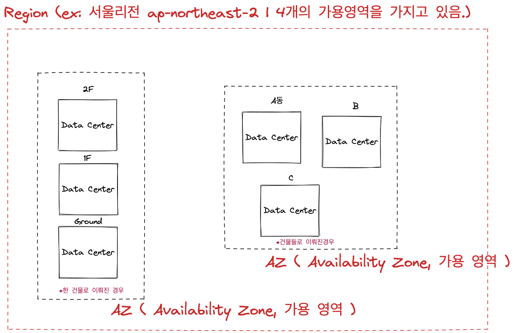

#### AWS 데이터 센터

- 보통 단일 데이터 센터에서 수반개의 서버를 운영
- 모든 데이터 센터는 "콜드 연결"이 아니라 온라인으로 연결됨
- AWS 사용자 정의 네트워크 장비
  - 다양한 ODM (Original Design Manufacturer) 사용 ( 일반적인 장비가 아닌 별도로 디자인된 장비를 사용 )
  - 사용자 지정 네트워크 프로토콜 스택

### 가용 영역

- 각 가용영역은 하나이상의 데이터 센터

### 리전

- 두 개 이상의 가용영역으로 이루어져 있음 ( 서울은 4개 )
- 리전간 데이터 복제를 활성화
- AWS 백본 네트워크 인프라 사용 ( 별도의 네트워크 인프라 사용 | 인터넷보다 훨씬 빠름 )

[AWS | global infrastructure](https://aws.amazon.com/ko/about-aws/global-infrastructure/)

- Data Center와 POP( Points of Presence, Edge Location ) 와는 다른 장비이다.
- POP는 CloudFront, Route 53 같은 서비스 제공
- 각 리전별로 제공되는 서비스는 각기 다르다

#### 아키텍쳐용 리전

- 데이터 주권 및 규정 준수
- 사용자와 데이터간 근접성
- 서비스 및 기능 가용성 ( 내가 필요한 서비스가 그 리전에 없을수도 있기 때문에 )
- 비용 효율성

## 모듈 2: 가장 간단한 아키텍쳐

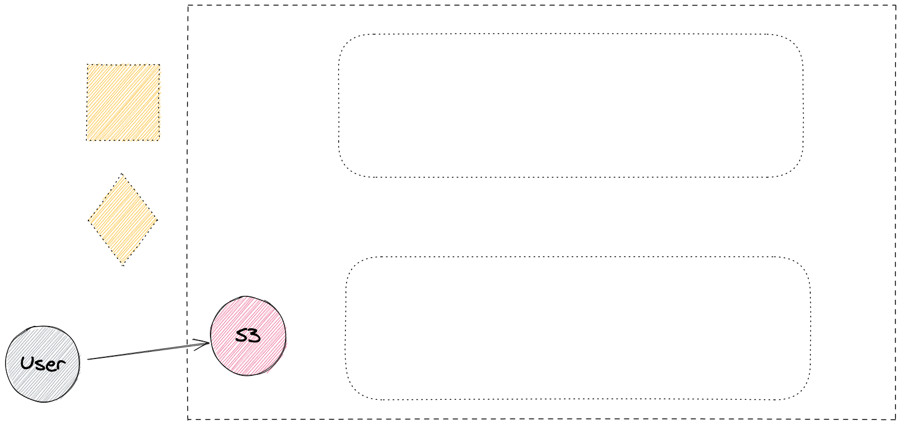

### Amazon S3

- 객체 수준 스토리지
- 99.999999999% 내구성을 제공
- 이벤트 트리거 ( 생성/삭제등 이벤트에 대해서 람다로 트리거 가능 )

### 스토리지의 종류

#### File Storage

- NAS같은 것들
- Network: LAN
- AWS: EFS, FSx for windows

#### Block Storage

- Network : Local I/O
- AWS: EBS, Instance Store

#### Object Storage

- google box, drive 같은 것들
- Network: internet
- AWS: S3
- 오브젝트 스토리지 특성상 올라가 있는 장소에서 직접 수정 불가능

### S3 사용 사례 1 - 정적 웹 콘텐츠와 미디어 저장 및 배포

#### 엑세스 제어 - 일반

- 비공개 : 소유자에게만 접근 허용
- 공개 : 다른 사람에게도 접근 허용
- 제한된 액세스: 사용자를 선별적으로 접근 허용 가능

#### 액세스 제어 - 버킷 정책

- IAM 서비스에 의해 정해진다
- JSON으로 표현 ( AWS Policy Generator )
- 때로는 도큐먼트가 관리가 어려울 수 있음

#### 액세스 포인트

- 엔드포인트를 사용하여 데이터에 액세스 하는 방법을 설명하는 전용 액세스 정책을 포함하는 고유한 호스트 이름
- 액세스 포인트에 따라 액세스 정책을 적용
- 다음을 지원
  - 단일사용자
  - 애플리케이션
  - 사용자들의 그룹 또는 애플리케이션

### S3 사용 사례 2 - 전체 정적 웹사이트 호스팅

#### 버전관리

- 실수로 삭제/ 오버라이트 된 경우데 롤백 가능하도록 버전 관리 제공
- 데이터 보존 또는 보호를 위해 S3 객체 잠금 사용 | 사용자의 실수/고의적으로 한번 올려진 데이터를 삭제하지 못하게 하는 기능

### S3 사용 사례 3 - 연산 및 대규모 분석용 데이터 스토어 ( Data Lake )

- 금융 거래 분석
- 클릭스트림 분석
- 미디어 트랜스코딩

### S3 사용 사례 4 - 백업도구

1. 회사 데이터 백업 데이터 저장
1. EC2의 백업 snapshot 저장

### S3로 데이터를 이동

- 버킷은 100개 객체수는 무제한
- 모든 파일 유형 지원
- API을 통한 작업
  1. 콘솔
  1. CLI
  1. SDK

### S3 멀티파트 업로드 지원

- 병렬로 올려서 빠르고
- 한개의 네트워크에서 세션 오류가 나더라도 복귀하기 쉬움
- 쪼개진 데이터는 버킷에서 하나로 합쳐진다

### S3 Transfer Acceleration

1. 일반 인터넷으로 전송
2. 엣지 로케이션까지 인터넷으로 옮기고, 내부에선 Amazon 네트워크를 통해 Amazon S3로 옮김 ( Amazon 내부 네트워크 속도는 매우 빠르다 )

- [Amazon S3 Transfer Acceleration 속도비교](http://s3-accelerate-speedtest.s3-accelerate.amazonaws.com/en/accelerate-speed-comparsion.html)

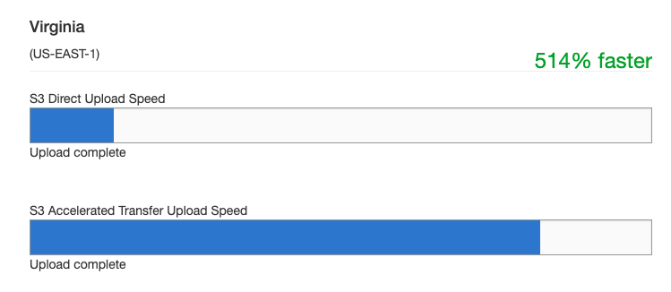

- 514배 빠르다.

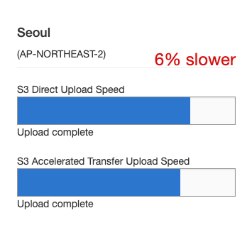

- 서울은 인터넷이 6% 더 빠르다.

### S3는 언제 사용해야 합니까?

#### + 모범 사용 사례

- 한번 쓰고 여러번 읽어야 하는 경우
- 데이터 액세스가 일시적으로 급증하는 경우
- 사용자가 매우 많고 콘텐츠양이 다양
- 데이터 세트가 계속 증가

#### - 불량 사용 사례

- 블록 스토리지 요구사항
- 자주 바뀌는 데이터
- 장기 아카이브 스토리지

### Amazon S3 Glacier

- 비용 : 신속 검색, 표준 검색

#### S3 스토리지 클래스

- Standard: 자주 액세스 하는 데이터
- Standard IA: 수명이 길고 자주 액세스 하지 않는 데이터
- One Zone IA : 자주 액세스하지 않지만, 빠른 액세스가 필요한 데이터, 하나의 가용영역에만 저장하기 때문에 가용성은 좀 떨어 질 수 있다.
- Glacier/Deep Archive (Deep Archive 사용하면 검색시 12시간에서 48시간 걸린다)

#### Amazon S3 인텔리전트 티어링

- 스토리지의 두 액세스 티어 사이에서 자동으로 객체 이동

### 수명 주기 정책

- 생성 후 기간을 기준으로 객체를 삭제 또는 이동 할 수 있습니다.

## 모듈 3 : 컴퓨터 계층 추가

- 적은 수의 일관된 사용자가 사용할 애플리케이션을 실행

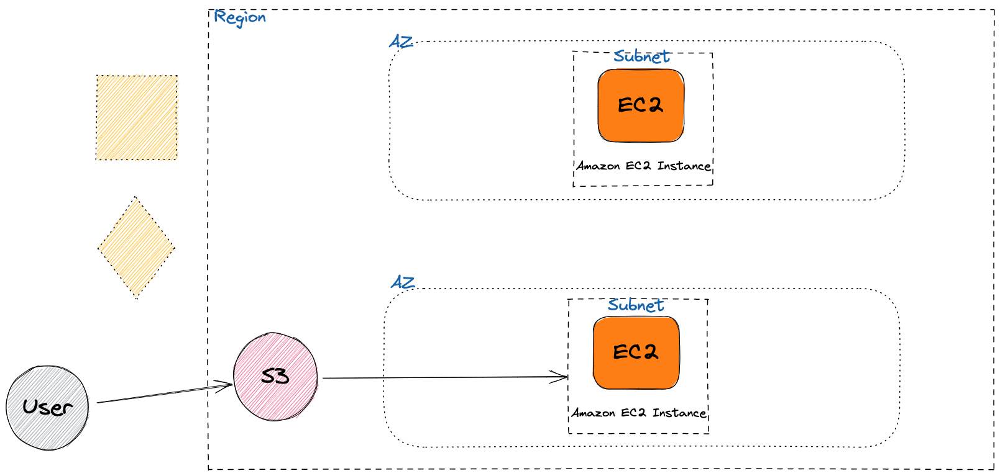

### 모듈 개요

- EC2
- 인스턴스 유형 및 패밀리
- EBS 볼륨
- 규정 준수 옵션

### Amazon 머신 이미지 (AMI)를 사용하여 Amazon EC2 인스턴스 시작

1. Pre-Built ( by Amazon ) 또는 퍼블릭 커뮤니티 AMI
2. AMI + Instance Type (F.G.S | Family, Generation, Size | ex: t2.large)
3. Configure Instance : 사용자 데이터, VPC | Subnet, 스팟 인스턴스, ENI, Public IP <-> EIP (Elastic IP| 5개/Region), 배치그룹, IAM Role: Instance Profile
4. Add Storage : EBS/Instance Storage ( 인스턴스 스토어는 모든 인스턴스 타입에서 지원 되지는 않는다. ex: t2 - X, c5d.large, c5d.xlarge)
5. Configuare Security Group
6. Key Pair : Pub/Pri
7. Launch Instance

- 런치된 인스턴스(Web/WAS)를 가지고 AMI로 만듬 ( 기본적으로 private 한 이미지 )

- metadata: 인스턴스를 설명하는 데이터: 실행중인 인스턴스를 구성 또는 관리

```bash
curl http://169.254.169.254/lastest/meta-data/instance-id
```

- t Family를 사용해서 인스턴스를 만들면 성능이 좋아 보다 저렴하다.

### EBS vs Instance Store( Storage )

### AMI는 어떠한 도움을 줍니까?

- 반복성
- 재사용성
- 복구성
- Marketplace 솔루션
- 백업

### 사용자 데이터를 사용하여 EC2 인스턴스 시작

사용자 AMI -> ( 아래 명령어 ) -> EC2 인스턴스 실행

```bash
yum update -y
service httpd start
chkconfig httpd on
```

### 인스턴스 메타데이터를 사용하여 EC2 인스턴스에 대한 정보 가져오기

사용자 AMI -> ( 아래 명령어 ) -> EC2 인스턴스 실행

```bash
!bin/bash
yum update -y
host = $(curl http://169.254.169.254/lastest/meta-data/instance-id)
```

### EBS ( Elastic Block Storage )는 어떤 문제를 해결합니까?

- 애플리케이션에는 블록수준 스토리지가 필요
- 인스턴스 스토어는 휘발성
- 종료후에도 데이터가 지속
- 데이터 볼륨을 백업
- 유의사항: 동일한 인스턴스에 여러 Amazon EBS볼륨이 있을 수 있지만 각 볼륨은 한번에 하나의 인스턴스에만 연결 할 수 있음

### EBS 볼륨 유형 ( 부트 볼륨이 될 수 없음 )

- 처리량 최적화 HDD : 자주 액세스
- 콜드 HDD : 자주 액세스 X

### 공유 파일 시스템 - 여러 인스턴스가 동일한 스토리지를 사용해야 하는 경우 어떻게 해야 합니까?

- EFS/FSx 가 적합
- EBS는 하나의 인스턴스에만 연결
- S3도 옵션이지만 이상적이지 않음

### Amazon FSx

- Windows/Lustre 워크로드

### EC2 인스턴스 유형

- 효율적인 인스턴스 사용률
- 불필요한 비용을 절감

#### 범용 - t, m

#### 컴퓨팅 최적화 - c

#### 메모리 최적화 - r

#### 엑셀러레이트 - p

#### 스토리지 최적화 - h

#### 인텔 제온 CPU - 최신식 제온 확장형 프로세서 사용하고 있다

### EC2 - 비용

- 온디맨드 인스턴스
- 예약 인스턴스
- Saving Plans
- 스팟 인스턴스

- on-demand가 제일 비싸고 spot instance가 제일 싸다 ( 최대 90% 저렴 )
- Reserved Instance, Saving Plans를 이용하면 on-demand 보단 더 싸게 이용 할수 있다. ( 40 ~ 70% 저렴 )

#### 온디맨드 인스턴스

- 초당 또는 시간당

#### 예약 인스턴스

- 용량에 대한 비용을 미리 지불
- 스탠다드 RI, 컴버터블 RI, 예약 RI
- 3가지 선결제 방법
- 여러 계정 사이에서 공유 가능

#### Savings Plans

- 스탠다드 RI, 컴버터블 RI 에서 확장형
- 예약 인스턴스에서 유연한 기능 제공

#### Spot Instance

- 인스턴스 종료 2분 전에 중단공지 받음

### EC2 전용 옵션

- 전용 인스턴스
- 전용 호스트

### 태그지정 모범사례

- 리소스 태그를 관리하는데 도움이 되는 자동화된 도구를 구현
- 태그는 너무 적게 사용하는 것보다 너무 많이 사용하는 것이 낫습니다
- 수정하기 쉽습니다
- 예: 앱버전, ENV, DNS 이름, 앱 스택 식별자

### EC2 고려사항

### 아키텍쳐 고려사항 1

- Cluster Placement Groups

- Spread Placement Groups

- Partition Placement Groups

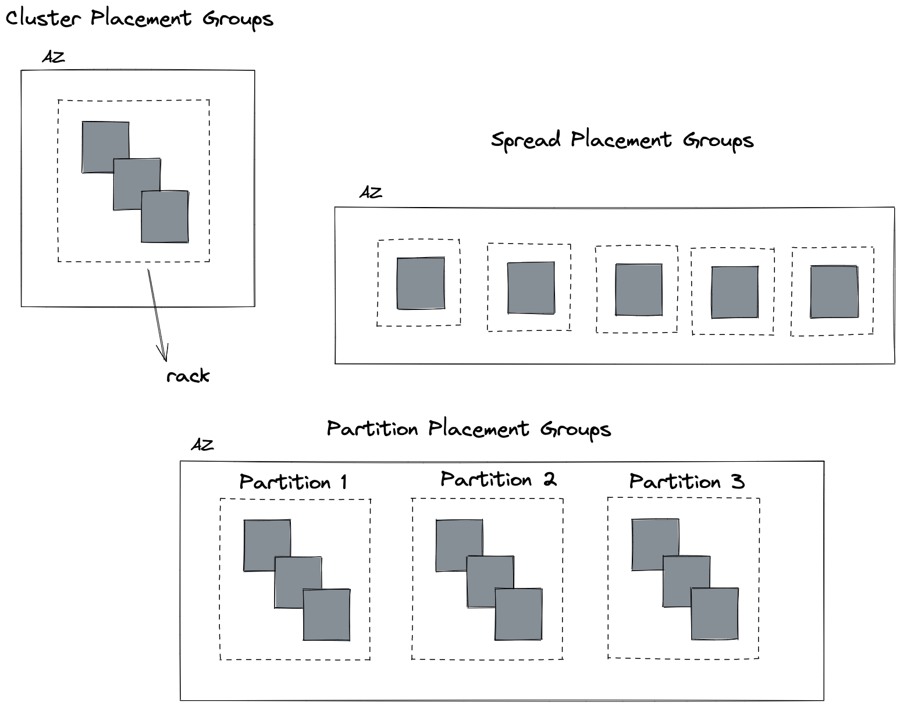

## 모듈 4: 데이터베이스 계층 추가

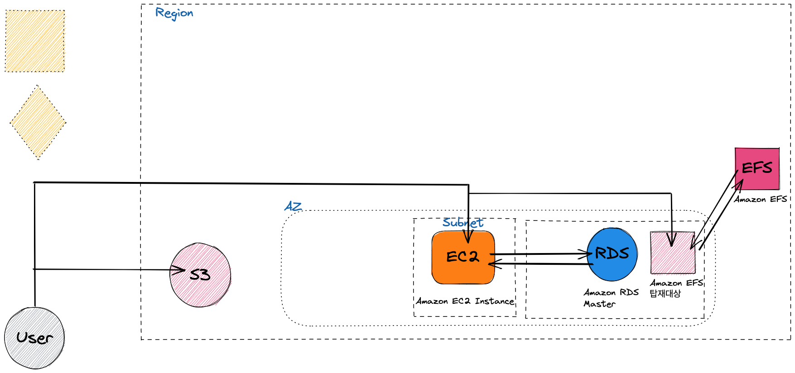

### 구조화된 데이터 스토리지 비교 및 대조

- 관계형 : sql기반 쿼리, 확장성 수직적
- 비관계형: 문서 수집에 집중, 수평적 확장

### 비관리형 데이터 베이스

- AWS가 관리 하지 않는 데이터 베이스

### RDS의 엔진

- Oracle
- MySql
- MariaDB
- postgreSQL
- MS-SQL
- Aurora ( MySql/ PostgreSQL )

### Amazon RDS 및 Amazon Aurora

- MySql및 Postgre와 호환되는 완전 관리형 데이터 베이스

### Amazon DynamoDB

- 완전 관리형 비관계형 데이터베이스 서비스
- 이벤트 중심 프로그래밍 ( 서버리스 컴퓨팅 )
- 최상의 수평 확장 기능

#### DynamoDB의 글로벌 테이블

- 단일 AWS계정이 소유하고 복제본 테이블로 식별되는 한개이상의 DynamoDB 테이블의 모음.
- 복제본 테이블은 글로벌 테이블의 일부로 기능하는 단일 DynamoDB 테이블
- 리전당 한 개의 복제본 테이블을 가질 수 있음.
- DynamoDB의 Streams라는 기능 사용 ( 변경된 사항이 있으면, 다른 리전으로 복제를 해줌 )

#### DynamoDB 일관성 옵션

- 최종적 일관성 ( = default, 0.5x 읽기, 강력한 일관성에 비해 2배더 읽을 수 있음)
- 강력한 일관성

### RDS 보안제어

- DB 자체에 대한 액세스
- 저장시 암호화
- 전송중 암호화
- 이벤트 알림

### DynamoDB 보안제어

- 정의 가능한 엑세스 권한 : 테이블에서 항목, 심지어 속성까지 모두 관리 가능
- 저장시 암호화
- SSL/TLS
- 고객 관리형 키

### AWS데이터베이스로 데이터 마이그레이션

- on-premise => aws

### AWS Database Migration Service ( DMS )

#### 데이터 마이그레이션이 힘든경우

- 데이터베이스가 너무 큼
- 연결이 너무 느림
- 개인 정보 보호 및 보안 문제

=> AWS Snowball Edge ( Snowball v2 )를 권장 ( Snowball 도 S3)

- Snowball Edge 디바이스를 사용하여 하나이상의 데이터베이스를 마이그레이션을 할수 있습니다
- 멀티 테라바이트 스토리지
- 인터넷 또는 DX 대역폭 사용

## 모듈 5: AWS 기반 네트워킹 1부

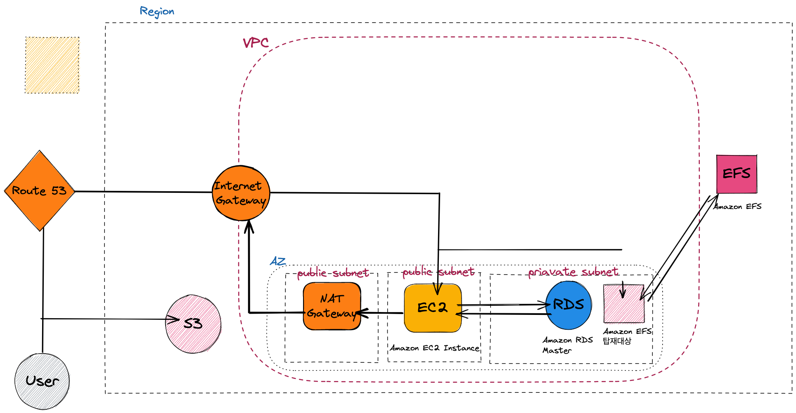

- 워크로드 격리를 제공하는 네트워크 환경에서 AWS 리소스를 배포하고 관리

1. VPC
2. 서브넷
3. 게이트웨이
4. 네트워크 보안

### VPC란?

- AWS Cloud 프라이빗 네트워크 공간
- 워크로드에 대한 논리적 격리 제공
- 리소스에 대한 사용자 지정 액세스 제어 및 보안 설정을 허용

### VPC 세부사항

- AWS 계정 전용 가상 네트워크
- IPv4또는 IPv6 주소 범위에 존재
- 점유 리소스에 대한 특정 CIDR 범위를 생성가능
- 인/아웃바운드 트래픽에 대한 엄격한 액세스 규칙을 제공

### 1. 하나의 VPC 사용

#### 하나의 VPC가 적절한 사용 사례는 제한적이다

- 한명 또는 매우 작은 팀이 관리하는 소규모 단일 애플리케이션
- 고성능 컴퓨팅
- 자격 증명 관리

### 2. 다중 VPC 패턴

#### 다음에 적합

- 단일 팀 또는 단일 조직
- 더 쉽게 표준 상태를 유지하고 액세스를 관리 할수 있는 제한된 팀
- 예외: 거버넌스 및 규정 준수 표준은 조직의 복잡성과 관계없이 워크로드 격리를 요구할 수 있음.

### 3. 복수 계정 패턴

- 대규모 조직 및 여러 IT 팀이 있는 조직
- 빠른 성장이 예상되는 중간 규모의 조직
- 이유: 액세스 및 표준 관리는 조직이 복잡할수록 더 어려울 수 있음

### VPC 제한

- 서비스 제한: 계정당 리전당 VPC 5개
- default VPC 포함 ( default VPC는 테스트 용 )
- soft limit임 정말 VPC증가가 필요할 경우 AWS service support 에서 증가요청 하면 됌.

/\* VPC가 만들어지면 자동으로 만들어지는 라우트 테이블이 있음 ( 메인 라우트 테이블이라고 함 )

### VPC 및 IP 주소지정

- 각 VPC는 사용자가 지정하는 프라이빗 IP주소의 범위를 예약
- CIDR (Classless Inter-Domain Routing)표기법 사용하여 정의
- 고유 IP 주소 가져오기 (BYOIP) 접두사 지원

#### VPC 툴

[vpcdesigner.com](https://vpcdesigner.com/)
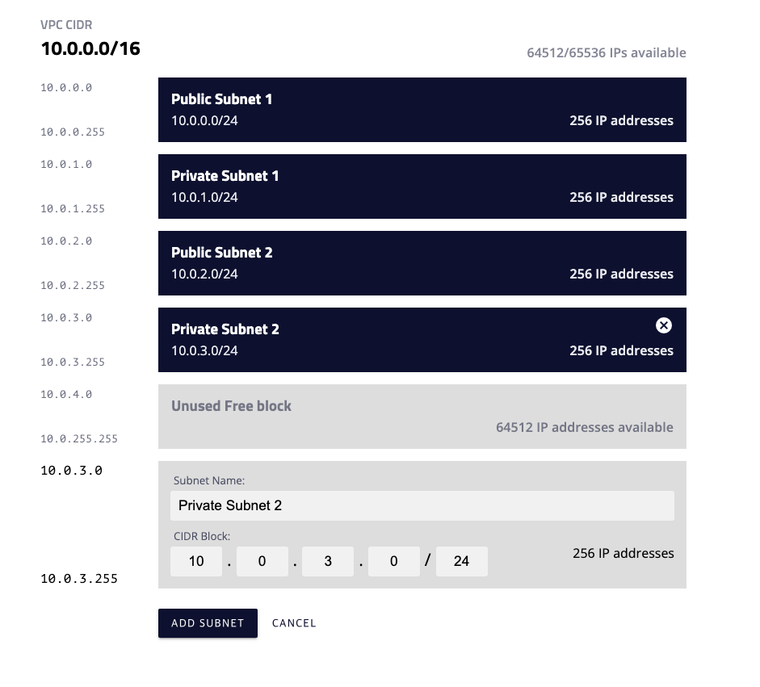

[network00.com](https://network00.com/)

### CIDR 예

- 0.0.0.0/0 = 모든 IP
- 10.22.33.44/32 = 10.22.33.44
- 10.22.33.0/24 = 10.22.33.\*
- 10.22.0.0/16 = 10.22.\*.\*

### 서브넷을 사용하여 VPC 분리

- CIDR/22인 VPC는 총 1024개의 IP를 포함합니다.

### 퍼블릭 서브넷에 인터넷에 연결

- 퍼블릭 인터넷에 대한 인/아웃 바운드 액세스를 지원하도록 인터넷 게이트웨이에 대한 라우팅 테이블 항목을 포함

#### 인터넷 게이트웨이

1. VPC의 인스턴스와 인터넷간 통신 허용
2. 기본적으로 가용성이 뛰어나고, 수평적 확장
3. 인터넷으로 라우팅 가능한 트래픽에 대한 서브넷 라우팅 테이블에 대상을 제공

### 프라이빗 서브넷에 인터넷 연결

- 아웃바운드로만 연결 가능하도록 함
- 웹 어플리케이션 인스턴스는 보통은 퍼블릭 서브넷에 노출시키지만 때에 따라서는 프라이빗 서브넷에 두고 ELB를 통해 노출하는 구성가능하다

#### NAT 게이트웨이

- 아웃바운드 트래픽을 시작하도록 활성화
- 프라이빗 인스턴스가 인터넷에서 인바운드 트래픽을 수신하는 것을 차단

### 서브넷 권장사항

- 작은 크기보다는 큰크기 (/24 이상)
- 서브넷에 사용가능한 IP가 부족한경우 추가 불가능
- 워크로드는 1개의 큰 서브넷에 구성하는 것보다 10개의 작은 서브넷에 구성하는게 더 복잡

### 탄력적 네트워크 인터페이스

#### 인스턴스에 네트워크 인터페이스가 두 개 이상 있는 이유

- 관리 네트워크 생성
- VPC에서 네트워크 및 보안 어플라이언스 사용
- 별도의 서브넷에 있는 워크로드/역할로 이중 홈 인스턴스 생성

### PIP, EIP

- PIP, EIP = 공인 아이피
- PIP는 EC2를 쓸때 자동으로 생성시킨다 ( 이때 안시키면 나중에 생성 불가능 )
- PIP를 안붙인 EC2에 붙일 수 있다. ( EIP는 5개의 리미트가 있다 )

### 보안그룹: 트래픽 제어

- 대부분 조직은 각 기능 티어에 대한 인바운드 규칙으로 보안 그룹을 생성

### 네트워크 ACL

- 서브넷 경계의 방화벽
- 기본적으로 모든 인바운드 및 아웃바운드 트래픽을 허용
- 상태 비저장이므로 인바운드 및 아웃바운드 트래픽 모두에 대한 명시적인 규칙이 필요합니다.
- 보안그룹은 반드시 사용해야하고 ACL은 필요에 따라서 사용가능

### VPC에 트래픽 보내기

1. 인터넷 게이트웨이를 VPC에 연결
2. 라우팅 테이블을 인터넷 게이트 웨이에 연결
3. 인스턴스에 퍼블릭IP 또는 탄력적 IP가 있는지
4. 네트워크 ACL과 SG가 관련 트래픽 흐름을 허용하는지 확인

### VPC 연결 - VPC 피어링

- 프라이빗 IP주소 사용
- 내부 및 리전간 지원
- IP공간은 중복될수 없음
- 두 VPC간 하나의 피어링 리소스만 해당
- 전이적 피어링 관례는 지원되지 않음
- 서로다른 AWS 계정간

### VPC 피어링

- 인터넷 게이트웨이 또는 가상 게이트웨이가 필요없음
- 고가용성 연결 단일 장애지점 없음
- 대역폭 병목 현상 없음
- 트래픽은 항상 글로벌 AWS 백본에서 유지됨

## 모듈 6: AWS 기반 네트워킹 2부

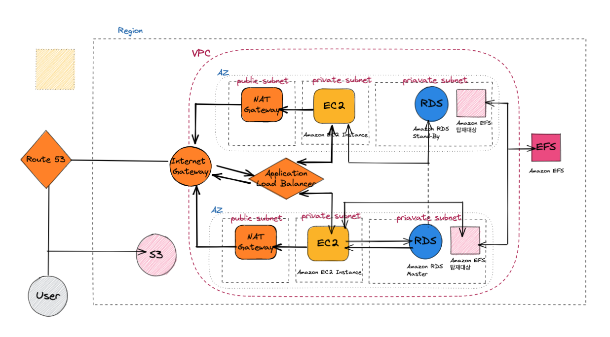

- 애플리케이션은 훨씬 더 큰 사용자 기반 및 변동 로드를 지원해야 하며 가용영역 수준의 장애를 처리해야 합니다

- 네트워크 연결
- VPC 엔드 포인트
- 로드 밸런싱
- 고가용성

### Transit Gateway

- 단일 게이트 웨이로 최대 5000개의 VPC와 온프레미스 환경 연결
- 네트워크 사이를 이동하는 모등 트레픽의 허브
- 가용성의 뛰어나고 유연한 완전 관리형 라우팅 서비스
- 멀티 캐스트 및 리전간 피어링 허용

#### Transit Gateway가 필요한 시나리오

1. VPC 3개 모두 완벽히 연결
1. 연결을 격리하고 VPN 액세스를 원할때 ( VPC 는 VPN 으로만, VPC끼리 통신 X, VPN -> VPC는 허용)

### VPC 엔드포인트

- VPC 외부 서비스와 프라이빗 하게 연결
- 인터넷을 통과할 필요가 없다.
- 동일한 리전에 잇어야함
- 가용성이 뛰어나고, 중복적이고, 수평적으로 확장됨

### 두가지 유형의 엔드포인트

#### 인터페이스 엔드포인트 (ENI)

- EC2, ELB 등등 다수
- 다른 AWS 계정에서 호스팅하는 엔드포인트 서비스
- 인터넷을 안나가도 됌

#### 게이트웨이 엔드포인드

- Router 등록을 해야함
- S3, DynamoDB ( 최근에 s3는 Interface 도 지원)
- Subnet의 route table을 업데이트 시켜야함

[AWS PrivateLink for Amazon S3](https://aws.amazon.com/ko/blogs/aws/aws-privatelink-for-amazon-s3-now-available/)

### VPC 인터페이스 엔드포인트 ( Private Link )

- 외부망을 통하지 않고 리전내에 VPC끼리 통신할 수 있게 함

### ELB

### fail-open 매커니즘

- 타겟 인스턴스가 다 망가졌을때, 에러보내지 않고 망가졌다고 보낸 타겟에 그냥 보내는 매커니즘

### ELB 옵션

- Application Load Balancer ( L7, HTTP, HTTPS 트래픽의 고급 로드)
- Network Load Balancer ( TCP, UDP, TLS 등 L4 연결 수준에서 운영)
- Classic Load Balancer (L7 L4를 한번에 처리하도록 함)
- Gateway Load Balancer ( Appliance - 소프트웨어적으로 구현됨, L3/L4 사이에 위치, 보안과 관련됨 )

### ELB를 사용해야 하는 이유

- 고가용성
- 상태확인
- 보안기능
- TLS 종료

### ELB 설계 패턴

1. Path-Base 설계

### 다중 리전 고가용성 ( DNS | Route 53 )

- 53 port를 쓰니 53이라고 이름을 명명
- 멀티플 라우팅 옵션

### Route 53이 고가용성에 어떻게 도움이 됩니까?

- 엄격한 SLA의 경우 AGA ( Global Accelerate ) 사용

### Route 53 라우팅 옵션

- 상태 확인 및 DNS 장애 조치
- 지리 위치 라우팅
- 지리 근접 라우팅
- 다중 값 응답

## 모듈 7: AWS Identity and Access Management (IAM)

- 팀원이 전문적인 역할을 맡고 있을 만큼 충분히 큰 규모의 조직입니다. 필수 권한을 통한 보호 및 액세스 제어 기능이 필요합니다.

### IAM 모듈 개요

- IAM 사용자, 그룹 및 역할
- 연동 자격 증명 관리
- Amazon Cognito
- AWS Organization

### IAM

- 다은 AWS 서비스와 통합
- 연동 자격증명관리
- 애플리케이션의 안저한 액세스
- 세부적 권한
- 5000개가 맥시멈

### IAM User 생성 단계

- Root User -> Admin User -> IAM User
- Root User는 가입을 한 유저 ( Email/Password + MFA ( otp 같은것 ))
- Root User는 Admin User를 만들고 빠져야 한다.

### 정책의 종류

1. Indentity-based Policy ( 자격증명기반 정책)
   1. managed (AWS, Customer)
   2. inline (embeded)
2. Resource-based Policy ( 리소스기반 정책)

### 권한평가 우선순위

1. 명시적 거부
2. 명시적 허용
3. 디폴트는 거부

### STS ( Security Token Service )

- Role 사용에 관여
- AssumeRole (API) : 모자를 쓴다.
- AKSK : Credential 정보
- TK: Token
- T: Timer ( expirate date )

### Amazon Cognito

- 웹/앱에 대한 인증, 권한 부여 및 사용자관리를 제공하는 완전 관리형 서비스
  - 사용자 풀
  - 자격증명 풀
- 개발/운영은 IAM User
- 이용하는 것은 IAM Role

### Landing Zone

- AWS 모범 사례에 따라 안전한 다중계정 AWS 환경을 빠르게 설정할 수 있도록 도와주는 솔루션으로 다음 기능을 갖추고 있습니다

1. 다중 계정 구조
2. Account Vending Machine
3. 사용자 액세스
4. 알림

### 중앙 집중식 계정 관리

- 그룹 기반 계정관리
- AWS 서비스에 대한 정책 기반 액세스
- 자동화된 계정 생성 및 관리
- 통합 결제
- API 기반

## 모듈 8: 탄력성, 고가용성 및 모니터링

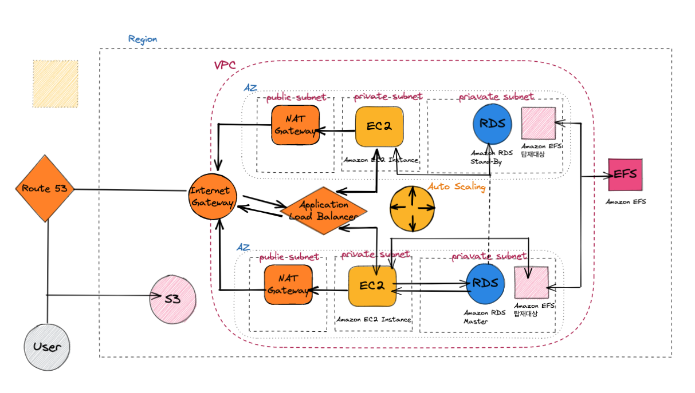

- 조직에서 급격한 성장 ( 수만 명의 사용자 )이 발생하고 있으며, 아키텍처에서 용량의 큰 변화를 처리

### 고가용성 모듈 개요

- 탄력성의 이해
- 모니터링
- 규모조정

### 고가용성 요소

- 내결함성
- 복구성
- 확장성

### 세가지 유형의 탄력성

- 시간기반
- 볼륨기반
- 예측기반

### 모니터링 이유

- 운영상태
- 리소스 활용
- 애플리케이션 성능
- 보안감사

\+ 비용을 이해하기 위한 모니터링

### Cloud Watch

- 특정 상황에 이벤트를 날린다.

#### 응답하는 방식

- 지표
- 로그
- 경보
- 이벤트
- 규칙
- 대상

### CloudWatch 경보 -> SNS / AutoScaling

### CloudTrail

- 계정에서 이루어지는 모든 API 호출을 기록하고 지정된 S3 버킷에 로그를 저장

### 탄력성 확보 및 아키텍쳐 확장 -> EC2 AutoScaling Service

- CloudWatch의 결보에 따라 인스턴스를 시작 또는 종료
- 지정된 경우, 새 인스턴스를 로드 밸런서에 자동으로 등록
- 여러 가용 영역에 걸쳐 시작할 수 있습니다.

### Auto Scaling 고려사항

- 여러 유형의 autoscaling을 결합 해야 할수 있음
- 단계 조정을 사용하여 아키텍처를 조정하려면 더 많은 작업이 필요할 수 있음
- 일부 아키텍쳐의 경우 둘 이상의 지표를 사용하여 조정 (CPU 외 추가 지표)
- 조기에 빠르게 확장하고 시간이 지남에 따라 천천히 축소
- 수명 주기 후크 사용

\+ 주의 : 인스턴스가 시작후 완전히 사용 가능한 상태가 되려면 몇 분 정도 걸릴 수 있습니다.

### EC2 인스턴트에 Cloud Watch를 붙였는데 EC2가 종료되고 다시 시작되어도 계속 모니터링 가능한가요 ?

- CW Agent 에 의해 API 형태로 CloudWatch 서비스의 Endpoint로 접속하여 데이터를 처리합니다.
- IP주소 변화가 있어도 문제 없도록 구성 되어 있습니다.

### 적응형 용량이 핫 키와 핫 파티션 문제를 해결해 주지는 않습니다.

- 파티션 키값 균등성 좋게 만들어야 한다 ( 사용자 ID, 디바이스 ID )

## 모듈: 9 자동화

- 지속적 성장을 위해서는 자동화를 시작해야 합니다. 조직에 있는 다양한 아키텍처를 일관되게 배포, 관리, 업데이트할 방법이 필요합니다

### 자동화 모듈 개요

- 자동화가 필요한 이유
- 인프라 자동화
- 배포자동화

### 인프라 자동화 - AWS CloudFormation

- 인트라를 설명하는 공통 언어를 제공합니다
- 설명된 리소스를 자동화된 방식으로 생성하고 구축합니다.

### 어떻게 작동합니까?

- JSON/YAML
- 소스코드로 취급
- 기존 리소스 가져오기

### IaC

- 드리프트 감지 지원 : 아키텍쳐 스택과 실제 배포분과의 차이점 노출

[quick start](https://aws.amazon.com/ko/quickstart/?solutions-all.sort-by=item.additionalFields.sortDate&solutions-all.sort-order=desc&awsf.filter-content-type=*all&awsf.filter-tech-category=*all&awsf.filter-industry=*all)

### System Manager

- 자동화된 구성 및 대규모 시스템의 지속적 관리
- 모든 Windows 및 Linux 워크로드
- Amazon EC2 또는 온프레미스에서 실행

1. 명령실행
2. 패치관리
3. 세션관리자 | putty 안쓰고 web으로
4. 유지관리시간
5. 상태관리자
6. 인벤토리

### AWS OpsWorks

- CHEF, puppet 기반 ( 근데, 우리나라에선 Ansible을 더 많이 사용한다 )
- AWS OpsWorks for Chef Automate
- AWS OpsWorks for Puppet Enterprise
- OpsWorks Stacks : 인스턴스 수명주기별로 트리거

### Elastic Beanstalk

- 가장 간편하게 사용할 수 있음

## 모듈 10: 캐싱

### CloudFront를 구성하는 방법

1. Amazon S3 버킷 또는 HTTP/S 엔드포인트
2. 웹 배포
3. DNS 할당
4. 구성정보

### 콘텐츠 만료 방법

1. TTL (Time To Live)
2. 객체이름 변경 ( 버전정보 )
3. 객체 무효화 ( 마지막 수단 | 매우 비효율적이고 비용이 많이 듦)

### 웹티어 캐싱

### 세션 관리

- ELB : 사용자 세션을 관리하는 특정 서버로 요청을 라우팅할 수 있습니다.
- 클라이언트 측 쿠키
- 비용 효율성
- 세션 검색 속도 증가

### 상태 정보를 위해 DynamoDB를 사용하는 경우

- 온라인 게임사이트 등에서 사용
- 하지만 속도 이슈는 계속 있음 => DEX를 사용

### RDB는 Amazon ElastiCache 사용

### Memcached vs Redis

### 연속 쓰기

- 캐시에다 먼저 쓰고 데이터베이스에다 쓴다.

### 레이지 로딩

- 캐시 미스시, 데이터베이스 읽고, 캐시에 쓰기

=> 연속쓰기 레이지로딩은 선택하는게 아니고 프래그래밍 적으로 구현해야 하는 것

### TTL추가

## 모듈 11: 결합 해제된 아키텍처 구축

- 이제 아키텍처는 수십만 명의 사용자들이 지원하지만 일부가 실패하면 전체 애플리케이션이 실패합니다. 종속성을 제거해야합니다.

### 결합 해제된 아키택처 구축 모듈 개요

- 결합 해제된 아키텍처
- Amazon SQS 및 Amazon SNS를 사용하여 결합 해제된 아키텍처 구축

### Amazon SQS ( Simple Queue Service )

- 완전 관리형 메시지 대기열 서비스
- 메시지는 처리 및 삭제될 때까지 저장
- 발신자와 수신자간 버퍼 역할

#### 대기열 유형

- 표준 대기열 ( Standard ) : 최소한 1번, 초당 트랜잭션 ( TPS )
- FIFO 대기열 : 정확히 1번, 초당 3000건

### Amazon Simple Notification Service ( Amazon SNS )

- Pub/Sub, Fan-out

#### 구독 유형

- 이메일
- HTTP/HTTPS
- SMS
- SQS 대기열
- 람다

#### 일반적인 사용 사래

- 애플리케이션 시스템 경보
- 모바일 푸시
- 푸시 이메일 및 문자 메시지

#### 특성

- 하나의 게시된 메시지
- 리콜 옵션이 없음
- HTTP/HTTPS 재시도
- 순서 및 전달을 보장할 수 없음

### Amazon MQ로 개발

- 클라우드에서 메시지 브로커를 손쉽게 설정하고 운영할 수 있습니다.
- Active MQ 콘솔에 직접 액세스할 수 있습니다
- 개방형 표준 API 및 프로토콜과 호환
  - JMS, NMS, AMQP, STOMP, MQTT, WebSocket 포함

## 모듈 12: 마이크로 서비스 및 서버리스 아키텍쳐

- 모놀리식 아키텍처가 분리되면 개별 구성 요소가 별도의 팀에서 관리되며, 이에 따라 한 팀에서 구성 요소를 변경하는 경우 충돌이 발생할 수 있습니다.

### 마이크로 서비스 및 서버리스 아키텍쳐 개요

- 마이크로 서비스 구축
- 컨테이너 서비스 ( Docker )
- 서버리스 환경구성

### 컨테이너 서비스

- 반복 가능
- 독립형 실행 환경
- VM보다 더 빠른 처리 속도

### ECS

- 컨테이너 실행을 조정
- 노드플릿 유지
- 인프라구축

### 컨테이너 중앙 저장소

- Amazon ECS Container Registry ( DockerHub 같은거 )

### 서버리스 환경 ( Lambda )

- 서버를 관리하지 않고 앱과 서비스를 구축하고 실행
- 완전 관리형 컴퓨팅 서비스
- 상태 비저장 코드 실행
- 일정에서 또는 이벤트에 대한 응답으로 코드실행
- 엣지에서 실행가능
- 처리시간이 15분이 넘어가면 안됌

#### 비용

- 요청시에만 컴퓨팅 리소스 사용

### Amazon API Gateway

- 애플리케이션의 "현관" 역할을 하는 API를 생성

### 람다 오케스트레이션 - AWS Step Functions

- 시각적 워크플로
- 애플리케이션 기능을 단계별로 실행
- 각 단계를 자동으로 트리거하고 추적
- 단계가 실패한 경우 단순 오류를 파악하여 로깅
